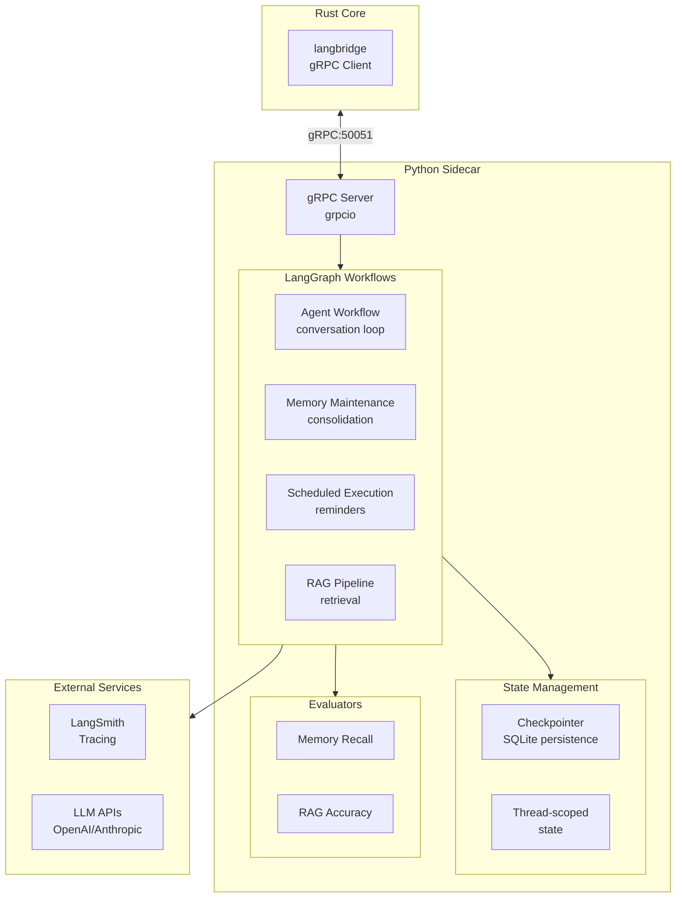

# LangGraph Sidecar Architecture

The Python sidecar provides AI orchestration capabilities through LangGraph, handling complex workflows, memory maintenance, and scheduled tasks.

---

## 🎯 Overview



---

## 🐍 Python Sidecar Structure

```
sidecar/
├── src/
│   ├── server.py              # gRPC server entry point
│   ├── workflows/
│   │   ├── __init__.py
│   │   ├── agent.py           # Main agent conversation loop
│   │   ├── memory_maintenance.py  # Memory consolidation
│   │   ├── scheduled_execution.py # Reminder/scheduled tasks
│   │   └── rag.py             # RAG retrieval pipeline
│   ├── evaluators/
│   │   ├── __init__.py
│   │   ├── memory_recall.py   # Memory recall accuracy
│   │   └── rag_accuracy.py    # RAG precision@k
│   └── proto/
│       ├── orchestration_pb2.py      # Generated protobuf
│       ├── orchestration_pb2_grpc.py
│       ├── tracing_pb2.py
│       └── tracing_pb2_grpc.py
├── pyproject.toml
└── tests/
```

---

## 🔌 gRPC Protocol

### Service Definitions

```protobuf
// proto/orchestration.proto
syntax = "proto3";
package openrustclaw.orchestration;

service OrchestrationService {
    // Execute a LangGraph workflow
    rpc ExecuteWorkflow(WorkflowRequest) returns (WorkflowResponse);
    
    // Execute a workflow with streaming updates
    rpc ExecuteWorkflowStream(WorkflowRequest) returns (stream WorkflowUpdate);
    
    // Check workflow status
    rpc GetWorkflowStatus(StatusRequest) returns (StatusResponse);
}

message WorkflowRequest {
    string workflow_id = 1;     // e.g., "agent", "memory_maintenance"
    string thread_id = 2;       // Conversation thread ID
    string input = 3;           // JSON-serialized input
    map<string, string> metadata = 4;
}

message WorkflowResponse {
    string thread_id = 1;
    string output = 2;          // JSON-serialized output
    string status = 3;          // "completed", "pending_approval", "error"
    string error = 4;
    string trace_id = 5;        // LangSmith trace ID
}

message WorkflowUpdate {
    string step_name = 1;
    string status = 2;          // "running", "completed", "error"
    string output = 3;
    string trace_id = 4;
}
```

### Tracing Service

```protobuf
// proto/tracing.proto
syntax = "proto3";
package openrustclaw.tracing;

service TracingService {
    rpc SendTrace(TraceRequest) returns (TraceResponse);
}

message TraceRequest {
    string run_id = 1;
    string name = 2;
    string run_type = 3;        // "llm", "tool", "chain", "retriever"
    string parent_run_id = 4;
    string inputs = 5;          // JSON
    string outputs = 6;         // JSON
    string error = 7;
    string start_time = 8;
    string end_time = 9;
    string project_name = 10;
}
```

---

## 🔄 Agent Workflow

The main agent workflow handles the conversation loop with tool use:

```python
# src/workflows/agent.py
from langgraph.graph import StateGraph, END
from langgraph.checkpoint.sqlite import SqliteSaver
from typing import TypedDict, Annotated, Sequence
import operator

class AgentState(TypedDict):
    """State managed by the agent workflow."""
    messages: Annotated[Sequence[BaseMessage], operator.add]
    tool_calls: list[ToolCall]
    tool_results: list[ToolResult]
    iteration: int
    max_iterations: int

# Define the workflow graph
workflow = StateGraph(AgentState)

# Nodes
workflow.add_node("llm", call_llm)
workflow.add_node("tools", execute_tools)
workflow.add_node("memory_search", search_memory)
workflow.add_node("memory_store", store_memory)

# Edges
def should_continue(state: AgentState) -> str:
    """Determine next step based on state."""
    if state["iteration"] >= state["max_iterations"]:
        return END
    
    last_message = state["messages"][-1]
    if hasattr(last_message, "tool_calls") and last_message.tool_calls:
        return "tools"
    
    return END

workflow.set_entry_point("llm")
workflow.add_edge("llm", should_continue)
workflow.add_edge("tools", "llm")

# Compile with persistence
memory = SqliteSaver.from_conn_string("checkpoints.db")
agent_graph = workflow.compile(checkpointer=memory)
```

### Workflow Execution

```python
async def execute_agent_workflow(
    input_message: dict,
    thread_id: str,
    metadata: dict
) -> dict:
    """Execute the agent workflow for a single turn."""
    
    config = {
        "configurable": {"thread_id": thread_id},
        "metadata": metadata,
        "callbacks": [LangSmithTracer()],
    }
    
    # Run the workflow
    result = await agent_graph.ainvoke(
        {"messages": [HumanMessage(content=input_message["content"])]},
        config=config,
    )
    
    return {
        "response": result["messages"][-1].content,
        "tool_calls": result.get("tool_calls", []),
        "trace_id": config["callbacks"][0].trace_id,
    }
```

---

## 🧠 Memory Maintenance Workflow

Handles memory consolidation, deduplication, and archival:

```python
# src/workflows/memory_maintenance.py
from langgraph.graph import StateGraph
from datetime import datetime, timedelta

class MemoryMaintenanceState(TypedDict):
    user_id: str
    memories_to_consolidate: list[MemoryEntry]
    archive_summaries: list[str]
    pruned_count: int

workflow = StateGraph(MemoryMaintenanceState)

# Node: Identify candidates for consolidation
async def identify_candidates(state: MemoryMaintenanceState) -> dict:
    """Find memories older than 30 days with low access count."""
    cutoff = datetime.utcnow() - timedelta(days=30)
    
    candidates = await fetch_memories(
        user_id=state["user_id"],
        created_before=cutoff,
        access_count_lt=5,
        exclude_archived=True,
    )
    
    return {"memories_to_consolidate": candidates}

# Node: Generate summaries
async def generate_summaries(state: MemoryMaintenanceState) -> dict:
    """Use LLM to consolidate related memories into summaries."""
    memories = state["memories_to_consolidate"]
    
    # Group by topic using embeddings
    groups = cluster_by_similarity(memories, threshold=0.85)
    
    summaries = []
    for group in groups:
        if len(group) > 3:  # Only consolidate if enough related memories
            summary = await llm_generate_summary(group)
            summaries.append(summary)
    
    return {"archive_summaries": summaries}

# Node: Store archives and mark originals
async def archive_memories(state: MemoryMaintenanceState) -> dict:
    """Store summaries and mark original memories as archived."""
    for summary in state["archive_summaries"]:
        await store_archive_summary(
            user_id=state["user_id"],
            summary=summary,
            source_memories=summary.source_ids,
        )
    
    return {"pruned_count": len(state["memories_to_consolidate"])}

workflow.add_node("identify", identify_candidates)
workflow.add_node("summarize", generate_summaries)
workflow.add_node("archive", archive_memories)

workflow.set_entry_point("identify")
workflow.add_edge("identify", "summarize")
workflow.add_edge("summarize", "archive")
workflow.add_edge("archive", END)

memory_maintenance_graph = workflow.compile()
```

---

## ⏰ Scheduled Execution Workflow

Durable scheduling for reminders and recurring tasks:

```python
# src/workflows/scheduled_execution.py
from langgraph.graph import StateGraph
import pytz

class ScheduledExecutionState(TypedDict):
    job_id: str
    job_name: str
    workflow_type: str
    input_data: dict
    retry_count: int
    max_retries: int
    result: dict
    error: Optional[str]

workflow = StateGraph(ScheduledExecutionState)

# Node: Validate and prepare
async def prepare_execution(state: ScheduledExecutionState) -> dict:
    """Validate job and prepare execution context."""
    job = await get_job(state["job_id"])
    
    if job.status != "pending":
        raise ValueError(f"Job {state['job_id']} not in pending state")
    
    # Check idempotency
    if await is_duplicate_execution(job.idempotency_key):
        return {"result": {"status": "duplicate", "reason": "already executed"}}
    
    return {}

# Node: Execute the scheduled workflow
async def execute_scheduled_workflow(state: ScheduledExecutionState) -> dict:
    """Execute the actual workflow."""
    try:
        if state["workflow_type"] == "reminder":
            result = await execute_reminder(state["input_data"])
        elif state["workflow_type"] == "maintenance":
            result = await execute_maintenance(state["input_data"])
        elif state["workflow_type"] == "report":
            result = await execute_report(state["input_data"])
        else:
            raise ValueError(f"Unknown workflow type: {state['workflow_type']}")
        
        return {"result": result}
    
    except Exception as e:
        return {
            "error": str(e),
            "retry_count": state["retry_count"] + 1,
        }

# Node: Handle result
async def handle_result(state: ScheduledExecutionState) -> dict:
    """Process execution result and schedule retry if needed."""
    if state.get("error"):
        if state["retry_count"] < state["max_retries"]:
            # Schedule retry with exponential backoff
            delay = 2 ** state["retry_count"] * 60  # seconds
            await schedule_retry(state["job_id"], delay)
            return {"result": {"status": "retry_scheduled", "delay": delay}}
        else:
            # Max retries exceeded, move to dead letter
            await move_to_dead_letter(state["job_id"], state["error"])
            return {"result": {"status": "failed", "error": state["error"]}}
    
    # Success
    await mark_job_completed(state["job_id"])
    return {"result": {"status": "completed"}}

workflow.add_node("prepare", prepare_execution)
workflow.add_node("execute", execute_scheduled_workflow)
workflow.add_node("handle_result", handle_result)

workflow.set_entry_point("prepare")
workflow.add_edge("prepare", "execute")
workflow.add_edge("execute", "handle_result")
workflow.add_edge("handle_result", END)

scheduled_execution_graph = workflow.compile()
```

---

## 📚 RAG Pipeline Workflow

Document ingestion and retrieval:

```python
# src/workflows/rag.py
from langchain.text_splitter import RecursiveCharacterTextSplitter
from langchain_openai import OpenAIEmbeddings

class RAGState(TypedDict):
    documents: list[Document]
    chunks: list[Document]
    embeddings: list[list[float]]
    query: Optional[str]
    retrieved_chunks: list[Document]

workflow = StateGraph(RAGState)

# Node: Load and parse documents
async def load_documents(state: RAGState) -> dict:
    """Load documents from various sources."""
    documents = []
    for source in state["sources"]:
        if source["type"] == "file":
            docs = await load_file(source["path"])
        elif source["type"] == "url":
            docs = await load_url(source["url"])
        elif source["type"] == "github":
            docs = await load_github_repo(source["repo"])
        documents.extend(docs)
    
    return {"documents": documents}

# Node: Chunk documents
async def chunk_documents(state: RAGState) -> dict:
    """Split documents into chunks for embedding."""
    splitter = RecursiveCharacterTextSplitter(
        chunk_size=512,
        chunk_overlap=50,
        separators=["\n\n", "\n", ". ", " ", ""],
    )
    
    chunks = []
    for doc in state["documents"]:
        chunks.extend(splitter.split_documents([doc]))
    
    return {"chunks": chunks}

# Node: Generate embeddings
async def generate_embeddings(state: RAGState) -> dict:
    """Create embeddings for all chunks."""
    embedding_model = OpenAIEmbeddings(model="text-embedding-3-small")
    
    texts = [chunk.page_content for chunk in state["chunks"]]
    embeddings = await embedding_model.aembed_documents(texts)
    
    return {"embeddings": embeddings}

# Node: Store in vector database
async def store_vectors(state: RAGState) -> dict:
    """Store chunks and embeddings in libSQL."""
    for chunk, embedding in zip(state["chunks"], state["embeddings"]):
        await store_memory_entry(
            content=chunk.page_content,
            embedding=embedding,
            metadata=chunk.metadata,
            source=chunk.metadata.get("source"),
        )
    
    return {"stored_count": len(state["chunks"])}

# Node: Retrieve relevant chunks
async def retrieve_chunks(state: RAGState) -> dict:
    """Retrieve chunks relevant to the query."""
    if not state["query"]:
        return {"retrieved_chunks": []}
    
    # Generate query embedding
    embedding_model = OpenAIEmbeddings(model="text-embedding-3-small")
    query_embedding = await embedding_model.aembed_query(state["query"])
    
    # Search vector database
    results = await vector_search(
        query_embedding=query_embedding,
        top_k=5,
        filters=state.get("filters"),
    )
    
    return {"retrieved_chunks": results}

workflow.add_node("load", load_documents)
workflow.add_node("chunk", chunk_documents)
workflow.add_node("embed", generate_embeddings)
workflow.add_node("store", store_vectors)
workflow.add_node("retrieve", retrieve_chunks)

# Ingestion path
workflow.set_entry_point("load")
workflow.add_edge("load", "chunk")
workflow.add_edge("chunk", "embed")
workflow.add_edge("embed", "store")
workflow.add_edge("store", END)

# Retrieval path (alternate entry)
workflow.add_conditional_edges(
    "retrieve",
    lambda state: END if state["query"] else "load",
)

rag_graph = workflow.compile()
```

---

## 🔄 State Management

### Checkpoint Persistence

LangGraph provides built-in state persistence:

```python
from langgraph.checkpoint.sqlite import SqliteSaver

# Create checkpointer
memory = SqliteSaver.from_conn_string(
    conn_string="checkpoints.db",
    thread_id_prefix="openrustclaw_"
)

# Compile workflow with persistence
graph = workflow.compile(checkpointer=memory)

# Execution automatically saves state
result = await graph.ainvoke(
    {"messages": [HumanMessage(content="Hello")]},
    config={"configurable": {"thread_id": "session_123"}}
)

# Resume from checkpoint
result = await graph.ainvoke(
    None,  # Continue from last state
    config={"configurable": {"thread_id": "session_123"}}
)
```

### Thread-Scoped State

Each conversation gets its own thread:

```python
class ThreadManager:
    """Manages conversation threads with isolated state."""
    
    def __init__(self, checkpointer):
        self.checkpointer = checkpointer
        self.active_threads: dict[str, RunnableConfig] = {}
    
    def get_or_create_thread(
        self,
        thread_id: str,
        user_id: str,
    ) -> RunnableConfig:
        """Get existing thread or create new one."""
        if thread_id in self.active_threads:
            return self.active_threads[thread_id]
        
        config = {
            "configurable": {
                "thread_id": thread_id,
                "user_id": user_id,
            },
            "callbacks": [LangSmithTracer()],
        }
        
        self.active_threads[thread_id] = config
        return config
    
    async def delete_thread(self, thread_id: str):
        """Clean up thread state."""
        await self.checkpointer.adelete_thread(thread_id)
        self.active_threads.pop(thread_id, None)
```

---

## 📊 Evaluators

Offline evaluation datasets for continuous improvement:

### Memory Recall Evaluator

```python
# src/evaluators/memory_recall.py
from langsmith.evaluation import EvaluationResult, run_evaluator

@run_evaluator
def evaluate_memory_recall(run, example) -> EvaluationResult:
    """Evaluate memory recall accuracy."""
    
    query = example.inputs["query"]
    expected_memories = example.outputs["relevant_memories"]
    retrieved_memories = run.outputs["retrieved_memories"]
    
    # Calculate precision and recall
    expected_set = set(m["id"] for m in expected_memories)
    retrieved_set = set(m["id"] for m in retrieved_memories)
    
    true_positives = len(expected_set & retrieved_set)
    precision = true_positives / len(retrieved_set) if retrieved_set else 0
    recall = true_positives / len(expected_set) if expected_set else 0
    f1 = 2 * (precision * recall) / (precision + recall) if (precision + recall) else 0
    
    return EvaluationResult(
        key="memory_recall_f1",
        score=f1,
        comment=f"Precision: {precision:.2f}, Recall: {recall:.2f}",
    )
```

### RAG Accuracy Evaluator

```python
# src/evaluators/rag_accuracy.py
@run_evaluator
def evaluate_rag_accuracy(run, example) -> EvaluationResult:
    """Evaluate RAG retrieval quality."""
    
    query = example.inputs["query"]
    expected_answer = example.outputs["answer"]
    generated_answer = run.outputs["response"]
    retrieved_contexts = run.outputs["retrieved_contexts"]
    
    # Check if answer is supported by retrieved context
    faithfulness_score = check_answer_faithfulness(
        answer=generated_answer,
        contexts=retrieved_contexts,
    )
    
    # Check semantic similarity to expected answer
    answer_relevance = check_answer_relevance(
        generated=generated_answer,
        expected=expected_answer,
    )
    
    return EvaluationResult(
        key="rag_accuracy",
        score=(faithfulness_score + answer_relevance) / 2,
        comment=f"Faithfulness: {faithfulness_score:.2f}, Relevance: {answer_relevance:.2f}",
    )
```

---

## 🚀 Running the Sidecar

### Development

```bash
cd sidecar
source .venv/bin/activate
python src/server.py
```

### Production

```bash
# Using gunicorn for production
pip install gunicorn
gunicorn src.server:serve -w 4 -k uvicorn.workers.UvicornWorker --bind 0.0.0.0:50051
```

### Docker

```dockerfile
FROM python:3.11-slim

WORKDIR /app
COPY pyproject.toml .
COPY src/ ./src/

RUN pip install -e "."

EXPOSE 50051

CMD ["python", "src/server.py"]
```

---

## 📈 Monitoring

The sidecar exposes metrics via LangSmith:

```python
from langsmith import Client

# Initialize LangSmith client
langsmith_client = Client(
    api_key=os.getenv("LANGSMITH_API_KEY"),
    api_url=os.getenv("LANGSMITH_ENDPOINT"),
)

# All workflow executions are automatically traced
# View traces at: https://smith.langchain.com
```
