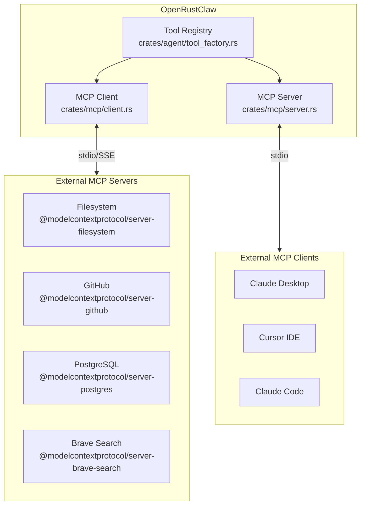
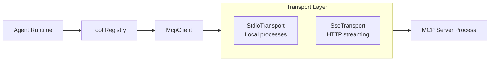
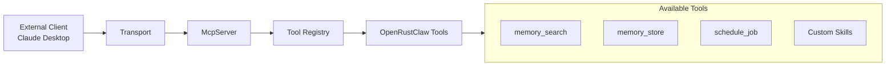
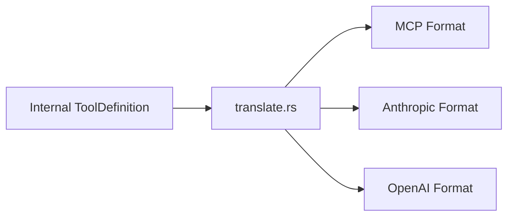

# Model Context Protocol (MCP) Integration

OpenRustClaw implements the Model Context Protocol (MCP), enabling seamless integration with thousands of existing tools and exposing its own capabilities to external clients.

---

## 🎯 MCP Overview

The Model Context Protocol is an open standard that enables AI systems to securely connect with external data sources and tools. OpenRustClaw supports MCP both as a **client** (using external tools) and as a **server** (exposing tools to external clients).



---

## 🔌 MCP Client

The MCP client connects OpenRustClaw to external MCP servers, extending its tool capabilities.

### Architecture



### Implementation

```rust
pub struct McpClient {
    transport: Box<dyn McpTransport>,
    server_capabilities: ServerCapabilities,
    tools: Vec<ToolDefinition>,
}

#[async_trait]
impl McpTransport: Send + Sync {
    async fn send(&mut self, request: JsonRpcRequest) -> Result<JsonRpcResponse>;
    async fn receive(&mut self) -> Result<JsonRpcRequest>;
    async fn close(&mut self) -> Result<()>;
}

impl McpClient {
    /// Connect to an MCP server and initialize session
    pub async fn connect(transport: Box<dyn McpTransport>) -> Result<Self> {
        let mut client = Self {
            transport,
            server_capabilities: Default::default(),
            tools: vec![],
        };
        
        // Initialize session
        let init_response = client.send_request(Request::Initialize {
            protocol_version: "2024-11-05".into(),
            capabilities: ClientCapabilities {
                tools: Some(ToolsCapability {}),
            },
            client_info: Implementation {
                name: "openrustclaw".into(),
                version: env!("CARGO_PKG_VERSION").into(),
            },
        }).await?;
        
        client.server_capabilities = init_response.capabilities;
        
        // List available tools
        let tools_response = client.send_request(Request::ToolsList {}).await?;
        client.tools = tools_response.tools;
        
        tracing::info!("Connected to MCP server with {} tools", client.tools.len());
        
        Ok(client)
    }
    
    /// Call a tool on the MCP server
    pub async fn call_tool(
        &mut self,
        name: &str,
        arguments: Value,
    ) -> Result<ToolOutput> {
        let response = self.send_request(Request::ToolCall {
            name: name.into(),
            arguments,
        }).await?;
        
        match response {
            Response::ToolResult { content, is_error } => {
                Ok(ToolOutput {
                    tool_call_id: generate_id(),
                    content: content_to_string(content),
                    is_error,
                })
            }
            Response::Error { code, message } => {
                Err(Error::Mcp(McpError::ToolExecution(format!(
                    "MCP error {}: {}", code, message
                ))))
            }
            _ => Err(Error::Mcp(McpError::ToolExecution(
                "Unexpected response type".into()
            ))),
        }
    }
}
```

### Transport Implementations

#### Stdio Transport

For local MCP servers as subprocesses:

```rust
pub struct StdioTransport {
    child: tokio::process::Child,
    stdin: tokio::io::BufWriter<tokio::process::ChildStdin>,
    stdout: tokio::io::BufReader<tokio::process::ChildStdout>,
}

impl StdioTransport {
    pub async fn new(command: &str, args: &[&str]) -> Result<Self> {
        let mut child = tokio::process::Command::new(command)
            .args(args)
            .stdin(Stdio::piped())
            .stdout(Stdio::piped())
            .stderr(Stdio::inherit())
            .spawn()?;
        
        let stdin = child.stdin.take().unwrap();
        let stdout = child.stdout.take().unwrap();
        
        Ok(Self {
            child,
            stdin: tokio::io::BufWriter::new(stdin),
            stdout: tokio::io::BufReader::new(stdout),
        })
    }
}

#[async_trait]
impl McpTransport for StdioTransport {
    async fn send(&mut self, request: JsonRpcRequest) -> Result<()> {
        let json = serde_json::to_string(&request)?;
        self.stdin.write_all(json.as_bytes()).await?;
        self.stdin.write_all(b"\n").await?;
        self.stdin.flush().await?;
        Ok(())
    }
    
    async fn receive(&mut self) -> Result<JsonRpcResponse> {
        let mut line = String::new();
        self.stdout.read_line(&mut line).await?;
        let response = serde_json::from_str(&line)?;
        Ok(response)
    }
}
```

#### Remote HTTP/SSE Transport

Remote MCP over HTTP/SSE is not implemented in the current `openrustclaw_mcp` runtime. The architecture supports adding another transport later, but the shipped code path today is stdio subprocess transport only.

---

## 🔧 MCP Server

OpenRustClaw can also act as an MCP server, exposing its tools to external clients like Claude Desktop and Cursor.

### Architecture



### Implementation

```rust
pub struct McpServer {
    tool_registry: Arc<ToolRegistry>,
    sessions: Arc<DashMap<String, McpSession>>,
}

impl McpServer {
    pub fn new(tool_registry: Arc<ToolRegistry>) -> Self {
        Self {
            tool_registry,
            sessions: Arc::new(DashMap::new()),
        }
    }
    
    pub async fn run(self, transport: impl McpTransport) -> Result<()> {
        let mut transport = transport;
        
        loop {
            match transport.receive().await? {
                Request::Initialize { protocol_version, client_info, .. } => {
                    tracing::info!("MCP client connected: {} {}", 
                        client_info.name, client_info.version);
                    
                    transport.send(Response::Initialize {
                        protocol_version: "2024-11-05".into(),
                        capabilities: ServerCapabilities {
                            tools: Some(ToolsServerCapability {
                                list_changed: true,
                            }),
                        },
                        server_info: Implementation {
                            name: "openrustclaw".into(),
                            version: env!("CARGO_PKG_VERSION").into(),
                        },
                    }).await?;
                }
                
                Request::ToolsList {} => {
                    let tools = self.list_tools().await?;
                    transport.send(Response::ToolsList { tools }).await?;
                }
                
                Request::ToolCall { name, arguments } => {
                    match self.execute_tool(&name, arguments).await {
                        Ok(output) => {
                            transport.send(Response::ToolResult {
                                content: vec![Content::text(output.content)],
                                is_error: output.is_error,
                            }).await?;
                        }
                        Err(e) => {
                            transport.send(Response::Error {
                                code: -32603,
                                message: e.to_string(),
                            }).await?;
                        }
                    }
                }
                
                Request::Ping {} => {
                    transport.send(Response::Pong {}).await?;
                }
                
                Request::Shutdown {} => {
                    transport.send(Response::Shutdown {}).await?;
                    break;
                }
            }
        }
        
        Ok(())
    }
    
    async fn list_tools(&self) -> Result<Vec<McpTool>> {
        let tools = self.tool_registry.list_all().await;
        
        Ok(tools.into_iter().map(|tool| McpTool {
            name: tool.name().into(),
            description: tool.description().into(),
            input_schema: tool.schema(),
        }).collect())
    }
    
    async fn execute_tool(&self, name: &str, arguments: Value) -> Result<ToolOutput> {
        let tool = self.tool_registry.get(name).await?;
        
        let ctx = ToolContext {
            session_id: "mcp".into(),
            user_id: "mcp".into(),
            workspace_path: None,
        };
        
        tool.execute(arguments, &ctx).await
    }
}
```

---

## 🔄 Tool Translation

MCP, Anthropic, and OpenAI use different tool schema formats. OpenRustClaw automatically translates between them:



### Translation Implementation

```rust
pub fn translate_tool_definition(
    tool: &ToolDefinition,
    target_format: ToolFormat,
) -> Value {
    match target_format {
        ToolFormat::Mcp => {
            serde_json::json!({
                "name": tool.name,
                "description": tool.description,
                "inputSchema": {
                    "type": "object",
                    "properties": tool.parameters.get("properties").cloned()
                        .unwrap_or_else(|| serde_json::json!({})),
                    "required": tool.parameters.get("required").cloned()
                        .unwrap_or_else(|| serde_json::json!([])),
                },
            })
        }
        
        ToolFormat::Anthropic => {
            serde_json::json!({
                "name": tool.name,
                "description": tool.description,
                "input_schema": tool.parameters,
            })
        }
        
        ToolFormat::OpenAi => {
            serde_json::json!({
                "type": "function",
                "function": {
                    "name": tool.name,
                    "description": tool.description,
                    "parameters": tool.parameters,
                    "strict": tool.strict,
                },
            })
        }
    }
}

pub fn translate_tool_call(
    call: &ToolCall,
    source_format: ToolFormat,
    target_format: ToolFormat,
) -> ToolCall {
    // Format-specific transformations
    match (source_format, target_format) {
        // MCP uses nested input, others use direct arguments
        (ToolFormat::Mcp, ToolFormat::Anthropic) | 
        (ToolFormat::Mcp, ToolFormat::OpenAi) => {
            ToolCall {
                id: call.id.clone(),
                name: call.name.clone(),
                arguments: call.arguments.get("input")
                    .cloned()
                    .unwrap_or_else(|| call.arguments.clone()),
            }
        }
        
        // Reverse transformation
        (ToolFormat::Anthropic, ToolFormat::Mcp) |
        (ToolFormat::OpenAi, ToolFormat::Mcp) => {
            ToolCall {
                id: call.id.clone(),
                name: call.name.clone(),
                arguments: serde_json::json!({
                    "input": call.arguments,
                }),
            }
        }
        
        // Same format, no change needed
        _ => call.clone(),
    }
}
```

---

## 📦 MCP Registry

The MCP registry manages connections to multiple MCP servers:

```rust
pub struct McpRegistry {
    clients: DashMap<String, Arc<Mutex<McpClient>>>,
    tool_to_server: DashMap<String, String>, // tool_name -> server_name
}

impl McpRegistry {
    /// Add an MCP server connection
    pub async fn add_server(
        &self,
        name: &str,
        config: McpServerConfig,
    ) -> Result<()> {
        let transport: Box<dyn McpTransport> = match config.transport {
            McpTransportConfig::Stdio { command, args } => {
                Box::new(StdioTransport::new(&command, &args).await?)
            }
            McpTransportConfig::Sse { url } => {
                Box::new(SseTransport::connect(&url).await?)
            }
        };
        
        let client = McpClient::connect(transport).await?;
        
        // Register all tools from this server
        for tool in &client.tools {
            self.tool_to_server.insert(tool.name.clone(), name.into());
        }
        
        self.clients.insert(name.into(), Arc::new(Mutex::new(client)));
        
        tracing::info!("Added MCP server '{}' with {} tools", name, client.tools.len());
        
        Ok(())
    }
    
    /// Execute a tool from any connected MCP server
    pub async fn execute_tool(
        &self,
        tool_name: &str,
        arguments: Value,
    ) -> Result<ToolOutput> {
        let server_name = self.tool_to_server
            .get(tool_name)
            .ok_or_else(|| Error::Mcp(McpError::ToolNotFound {
                server: "unknown".into(),
                tool: tool_name.into(),
            }))?;
        
        let client = self.clients
            .get(&*server_name)
            .ok_or_else(|| Error::Mcp(McpError::Connection(
                format!("Server '{}' not connected", server_name)
            )))?;
        
        let mut client = client.lock().await;
        client.call_tool(tool_name, arguments).await
    }
    
    /// List all available MCP tools
    pub async fn list_all_tools(&self) -> Vec<ToolDefinition> {
        let mut all_tools = vec![];
        
        for entry in self.clients.iter() {
            let client = entry.value().lock().await;
            all_tools.extend(client.tools.clone());
        }
        
        all_tools
    }
}
```

---

## 🔧 Configuration

The current MCP client integration is programmatic. The repo does not currently provide a built-in TOML loader such as `config/mcp-servers.toml`.

Today, the configuration surface is:

```rust
pub struct McpServerEntry {
    pub name: String,
    pub command: String,
    pub args: Vec<String>,
    pub enabled: bool,
}
```

Example:

```rust
use openrustclaw_mcp::registry::{McpRegistry, McpServerEntry};

let mut mcp_registry = McpRegistry::new(vec![
    McpServerEntry {
        name: "filesystem".into(),
        command: "npx".into(),
        args: vec![
            "-y".into(),
            "@modelcontextprotocol/server-filesystem".into(),
            "/home/user/docs".into(),
        ],
        enabled: true,
    },
    McpServerEntry {
        name: "github".into(),
        command: "npx".into(),
        args: vec![
            "-y".into(),
            "@modelcontextprotocol/server-github".into(),
        ],
        enabled: false,
    },
]);
```

If your application wants file-based MCP configuration, add that translation layer outside the `openrustclaw_mcp` crate and construct `Vec<McpServerEntry>` yourself.

---

## 🚀 Usage Examples

### As MCP Client

```rust
use openrustclaw_mcp::registry::{McpRegistry, McpServerEntry};

let mut mcp_registry = McpRegistry::new(vec![
    McpServerEntry {
        name: "filesystem".into(),
        command: "npx".into(),
        args: vec![
            "-y".into(),
            "@modelcontextprotocol/server-filesystem".into(),
            "/home/user/docs".into(),
        ],
        enabled: true,
    },
]);

mcp_registry.connect_all().await?;
mcp_registry.discover_all_tools().await?;

// Use MCP tools through the agent
let response = agent
    .chat("Search for files about 'memory' in my documents")
    .await?;
```

### As MCP Server

```bash
# Start OpenRustClaw as MCP server
openrustclaw mcp-server

# Or configure in Claude Desktop config:
# ~/Library/Application Support/Claude/claude_desktop_config.json
{
  "mcpServers": {
    "openrustclaw": {
      "command": "openrustclaw",
      "args": ["mcp-server"],
      "env": {
        "DATABASE_URL": "sqlite:///path/to/db"
      }
    }
  }
}
```

---

## 📊 Available MCP Servers

| Server | Package | Description |
|--------|---------|-------------|
| Filesystem | `@modelcontextprotocol/server-filesystem` | Read/write local files |
| GitHub | `@modelcontextprotocol/server-github` | GitHub API integration |
| PostgreSQL | `@modelcontextprotocol/server-postgres` | Database queries |
| SQLite | `@modelcontextprotocol/server-sqlite` | SQLite database access |
| Brave Search | `@modelcontextprotocol/server-brave-search` | Web search |
| Fetch | `@modelcontextprotocol/server-fetch` | HTTP requests |
| Puppeteer | `@modelcontextprotocol/server-puppeteer` | Browser automation |
| Sentry | `@modelcontextprotocol/server-sentry` | Error tracking |

See [Connecting MCP Servers](../guides/mcp-servers.md) for detailed setup instructions.
