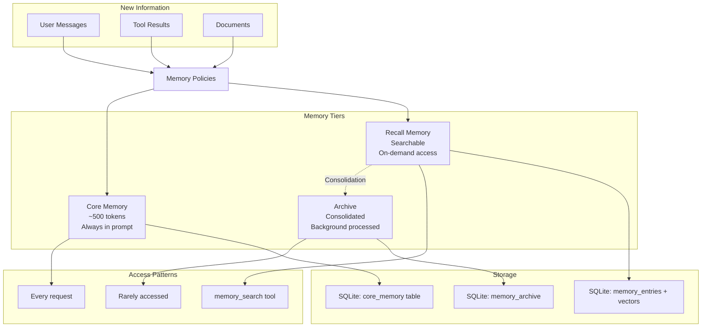
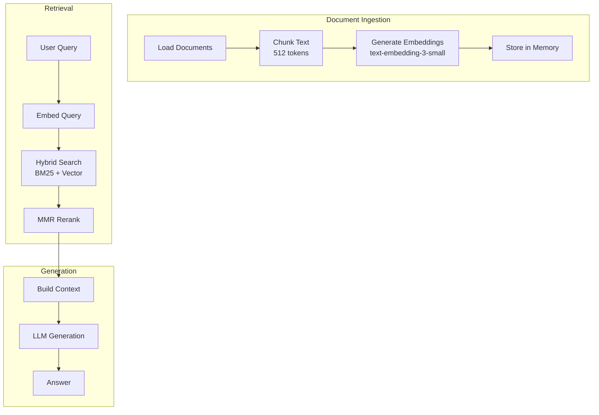

# Memory & RAG Architecture

OpenRustClaw's memory system uses a 3-tier architecture designed for efficiency, relevance, and scalability. This document explains how Core Memory, Recall Memory, and Archive work together with hybrid search and RAG.

---

## 🎯 3-Tier Memory Architecture



---

## 🧠 Core Memory

Core memory is a small, high-value key-value store (~500 tokens) that is always included in the system prompt.

### Characteristics

| Property | Value |
|----------|-------|
| **Size** | ~500 tokens maximum |
| **Access** | Every request (synchronous) |
| **Latency** | < 1ms |
| **Storage** | SQLite `core_memory` table |
| **Persistence** | Permanent |

### Schema

```rust
pub struct CoreEntry {
    pub key: String,           // e.g., "preferred_language"
    pub value: String,         // e.g., "Rust"
    pub importance: f32,       // 0.0 - 1.0 (for eviction)
    pub token_count: usize,    // Cached token count
    pub updated_at: DateTime<Utc>,
}
```

### Core Memory Manager

```rust
pub struct CoreMemoryManager {
    store: Arc<dyn CoreMemoryStore>,
    tokenizer: Tokenizer,  // tiktoken-rs
    max_tokens: usize,     // 500
}

impl CoreMemoryManager {
    /// Set a core memory entry, managing the budget
    pub async fn set(&self, user_id: &str, entry: CoreEntry) -> Result<()> {
        let current_tokens = self.store.total_tokens(user_id).await?;
        let new_tokens = self.tokenizer.count(&entry.value);
        
        // Check budget
        if current_tokens + new_tokens > self.max_tokens {
            // Evict lowest importance entries
            self.evict_to_budget(user_id, current_tokens + new_tokens - self.max_tokens).await?;
        }
        
        let entry = CoreEntry {
            token_count: new_tokens,
            ..entry
        };
        
        self.store.set(user_id, entry).await
    }
    
    /// Render core memory as formatted string for prompt
    pub async fn render(&self, user_id: &str) -> Result<String> {
        let entries = self.store.get_all(user_id).await?;
        
        // Sort by importance (descending)
        let mut entries = entries;
        entries.sort_by(|a, b| b.importance.partial_cmp(&a.importance).unwrap());
        
        // Build prompt section
        let mut output = String::from("## Core Memory\n\n");
        for entry in entries {
            output.push_str(&format!("{}: {}\n", entry.key, entry.value));
        }
        
        Ok(output)
    }
    
    /// Evict entries to make room
    async fn evict_to_budget(&self, user_id: &str, excess_tokens: usize) -> Result<()> {
        let entries = self.store.get_all(user_id).await?;
        
        // Sort by importance (ascending) and evict lowest
        let mut entries = entries;
        entries.sort_by(|a, b| a.importance.partial_cmp(&b.importance).unwrap());
        
        let mut tokens_to_evict = excess_tokens;
        for entry in entries {
            if tokens_to_evict == 0 {
                break;
            }
            self.store.remove(user_id, &entry.key).await?;
            tokens_to_evict = tokens_to_evict.saturating_sub(entry.token_count);
        }
        
        Ok(())
    }
}
```

### What Belongs in Core Memory

✅ **Good candidates:**
- User's name and role
- Preferred programming languages
- Project context
- Communication preferences
- Critical facts used frequently

❌ **Avoid:**
- Large code snippets
- Long conversations
- Infrequently accessed information
- Ephemeral data

---

## 🔍 Recall Memory

Recall memory is a searchable database of episodic, semantic, and procedural memories. It is accessed on-demand via the `memory_search` tool.

### Characteristics

| Property | Value |
|----------|-------|
| **Size** | Unlimited (pruned by TTL) |
| **Access** | Via `memory_search` tool only |
| **Search latency** | < 3ms (hybrid search) |
| **Storage** | SQLite + libSQL vectors |
| **Persistence** | Permanent (with expiration) |

### Schema

```rust
pub struct MemoryEntry {
    pub id: Uuid,
    pub memory_type: MemoryType,     // Episodic, Semantic, Procedural
    pub content: String,
    pub content_hash: String,        // SHA-256 for deduplication
    pub source: Option<String>,      // File path, URL, etc.
    pub source_type: Option<SourceType>,
    pub session_id: Option<Uuid>,
    pub user_id: Option<String>,
    pub namespace: String,           // e.g., "workspace", "personal"
    pub importance: f32,             // 0.0 - 1.0
    pub confidence: f32,             // 0.0 - 1.0
    pub access_count: u32,
    pub last_accessed: Option<DateTime<Utc>>,
    pub created_at: DateTime<Utc>,
    pub expires_at: Option<DateTime<Utc>>,
    pub metadata: Value,
}

pub enum MemoryType {
    Episodic,    // Events, conversations, experiences
    Semantic,    // Facts, concepts, knowledge
    Procedural,  // How-to, workflows, procedures
}
```

### Hybrid Search Algorithm

```rust
pub struct HybridSearcher {
    bm25: Arc<dyn FullTextSearch>,
    vector: Arc<dyn VectorSearch>,
    mmr: MmrReranker,
}

impl HybridSearcher {
    pub async fn search(&self, query: &MemoryQuery) -> Result<Vec<ScoredMemory>> {
        // Step 1: Parallel BM25 and vector search
        let (bm25_results, vector_results) = tokio::join!(
            self.bm25_search(&query.text, query.limit * 2),
            self.vector_search(&query.text, query.limit * 2),
        );
        
        // Step 2: Reciprocal Rank Fusion (RRF)
        let fused = self.reciprocal_rank_fusion(
            bm25_results?, 
            vector_results?,
            k=60,  // RRF constant
        );
        
        // Step 3: Maximal Marginal Relevance (MMR) for diversity
        let diverse = self.mmr_rerank(
            fused,
            lambda=query.diversity_lambda,  // 0.5 = balance relevance/diversity
            top_k=query.limit,
        );
        
        // Step 4: Temporal decay boost
        let scored = self.apply_temporal_decay(
            diverse,
            weight=query.recency_weight,  // 0.0 - 1.0
        );
        
        Ok(scored)
    }
    
    /// Reciprocal Rank Fusion combines results from multiple sources
    fn reciprocal_rank_fusion(
        &self,
        bm25: Vec<ScoredMemory>,
        vector: Vec<ScoredMemory>,
        k: f32,
    ) -> Vec<ScoredMemory> {
        let mut scores: HashMap<Uuid, f32> = HashMap::new();
        
        // Add BM25 scores
        for (rank, memory) in bm25.iter().enumerate() {
            let score = scores.entry(memory.entry.id).or_insert(0.0);
            *score += 1.0 / (k + rank as f32);
        }
        
        // Add vector scores
        for (rank, memory) in vector.iter().enumerate() {
            let score = scores.entry(memory.entry.id).or_insert(0.0);
            *score += 1.0 / (k + rank as f32);
        }
        
        // Convert back to sorted list
        let mut results: Vec<_> = scores.into_iter()
            .map(|(id, score)| ScoredMemory {
                entry: self.get_entry(&id),
                score,
            })
            .collect();
        
        results.sort_by(|a, b| b.score.partial_cmp(&a.score).unwrap());
        results
    }
    
    /// MMR balances relevance with diversity
    fn mmr_rerank(
        &self,
        candidates: Vec<ScoredMemory>,
        lambda: f32,
        top_k: usize,
    ) -> Vec<ScoredMemory> {
        let mut selected = vec![];
        let mut remaining = candidates;
        
        while selected.len() < top_k && !remaining.is_empty() {
            // Score each candidate by MMR formula
            let best_idx = remaining.iter()
                .enumerate()
                .map(|(idx, candidate)| {
                    let relevance = candidate.score;
                    let diversity = if selected.is_empty() {
                        1.0
                    } else {
                        1.0 - selected.iter()
                            .map(|s: &ScoredMemory| 
                                self.similarity(&candidate.entry, &s.entry))
                            .max_by(|a, b| a.partial_cmp(b).unwrap())
                            .unwrap_or(0.0)
                    };
                    
                    let mmr_score = lambda * relevance + (1.0 - lambda) * diversity;
                    (idx, mmr_score)
                })
                .max_by(|a, b| a.1.partial_cmp(&b.1).unwrap())
                .map(|(idx, _)| idx)
                .unwrap_or(0);
            
            selected.push(remaining.remove(best_idx));
        }
        
        selected
    }
    
    /// Apply temporal decay to boost recent memories
    fn apply_temporal_decay(
        &self,
        memories: Vec<ScoredMemory>,
        weight: f32,
    ) -> Vec<ScoredMemory> {
        let now = Utc::now();
        
        memories.into_iter()
            .map(|mut memory| {
                let age_days = (now - memory.entry.created_at).num_days() as f32;
                let decay = (-age_days / 30.0).exp();  // 30-day half-life
                
                memory.score = (1.0 - weight) * memory.score + weight * decay * memory.score;
                memory
            })
            .collect()
    }
}
```

---

## 📦 Archive Memory

Archive contains consolidated long-term summaries of old memories. It is maintained by a background LangGraph workflow.

### Characteristics

| Property | Value |
|----------|-------|
| **Size** | Summarized (compressed) |
| **Access** | Via search (lower priority) |
| **Update** | Background consolidation |
| **Storage** | SQLite `memory_archive` table |

### Consolidation Workflow

```python
# sidecar/src/workflows/memory_maintenance.py
async def consolidate_memories(user_id: str):
    """Consolidate old memories into archive summaries."""
    
    # 1. Find stale memories (>30 days, low access)
    stale = await fetch_stale_memories(
        user_id=user_id,
        older_than_days=30,
        max_access_count=3,
    )
    
    # 2. Cluster by similarity
    clusters = cluster_by_embedding(stale, threshold=0.85)
    
    # 3. Generate summaries
    for cluster in clusters:
        if len(cluster) < 3:
            continue  # Skip small clusters
        
        summary = await llm_generate_summary(
            memories=cluster,
            prompt="""Summarize these related memories into a coherent summary.
            Preserve key facts and relationships. Be concise."""
        )
        
        # 4. Store in archive
        await store_archive_entry(
            user_id=user_id,
            summary=summary.content,
            source_ids=[m.id for m in cluster],
            created_at=Utc::now(),
        )
        
        # 5. Mark originals as archived
        for memory in cluster:
            await mark_archived(memory.id)
```

---

## 📝 Memory Policies

All memory writes go through policy enforcement:

```rust
pub struct MemoryPolicies {
    deduplication: DeduplicationPolicy,
    importance: ImportancePolicy,
    confidence: ConfidencePolicy,
    ttl: TtlPolicy,
}

impl MemoryPolicies {
    pub async fn apply(&self, entry: &MemoryEntry) -> Result<PolicyDecision> {
        // 1. Check deduplication
        if let Some(existing) = self.deduplication.check(&entry.content_hash).await? {
            return Ok(PolicyDecision::Duplicate { existing_id: existing });
        }
        
        // 2. Score importance
        let importance = self.importance.score(&entry.content).await?;
        if importance < self.importance.threshold() {
            return Ok(PolicyDecision::Reject {
                reason: "Importance below threshold".into(),
            });
        }
        
        // 3. Score confidence
        let confidence = self.confidence.score(&entry).await?;
        if confidence < self.confidence.threshold() {
            return Ok(PolicyDecision::Reject {
                reason: "Confidence below threshold".into(),
            });
        }
        
        // 4. Calculate TTL
        let ttl = self.ttl.calculate(importance, confidence);
        
        Ok(PolicyDecision::Accept {
            importance,
            confidence,
            expires_at: Utc::now() + ttl,
        })
    }
}
```

### Deduplication

```rust
impl DeduplicationPolicy {
    pub async fn check(&self, content_hash: &str) -> Result<Option<Uuid>> {
        // Check exact hash match
        if let Some(existing) = self.store.get_by_hash(content_hash).await? {
            return Ok(Some(existing.id));
        }
        
        // Optional: Check semantic similarity for near-duplicates
        if self.semantic_dedupe {
            let embedding = self.embedder.embed(content_hash).await?;
            let similar = self.store.search_similar(&embedding, threshold=0.95).await?;
            
            if let Some(first) = similar.first() {
                return Ok(Some(first.entry.id));
            }
        }
        
        Ok(None)
    }
}
```

---

## 🔗 RAG Pipeline

The Retrieval-Augmented Generation (RAG) pipeline integrates external documents with the memory system.



### Document Ingestion

```rust
pub struct DocumentIngestor {
    text_splitter: RecursiveTextSplitter,
    embedder: Arc<dyn EmbeddingProvider>,
    memory_store: Arc<dyn MemoryStore>,
}

impl DocumentIngestor {
    pub async fn ingest(&self, document: Document) -> Result<Vec<Uuid>> {
        // 1. Split into chunks
        let chunks = self.text_splitter.split(
            &document.content,
            chunk_size=512,
            chunk_overlap=50,
        );
        
        // 2. Generate embeddings in batches
        let mut all_embeddings = vec![];
        for batch in chunks.chunks(100) {
            let texts: Vec<&str> = batch.iter().map(|c| c.as_str()).collect();
            let embeddings = self.embedder.embed(&texts).await?;
            all_embeddings.extend(embeddings);
        }
        
        // 3. Store as memory entries
        let mut entry_ids = vec![];
        for (chunk, embedding) in chunks.iter().zip(all_embeddings) {
            let entry = MemoryEntry {
                id: Uuid::new_v4(),
                memory_type: MemoryType::Semantic,
                content: chunk.clone(),
                content_hash: sha256(chunk),
                source: Some(document.source.clone()),
                source_type: Some(SourceType::Document),
                embedding: Some(embedding),
                ..Default::default()
            };
            
            let id = self.memory_store.store(entry).await?;
            entry_ids.push(id);
        }
        
        Ok(entry_ids)
    }
}
```

### Context Manager

The context manager coordinates memory retrieval for the agent:

```rust
pub struct ContextManager {
    core_memory: Arc<dyn CoreMemoryStore>,
    recall_memory: Arc<dyn MemoryStore>,
    max_context_tokens: usize,
}

impl ContextManager {
    pub async fn build_context(
        &self,
        user_id: &str,
        current_message: &Message,
        conversation_history: &[Message],
    ) -> Result<Context> {
        // 1. Always include core memory
        let core = self.core_memory.render(user_id).await?;
        let core_tokens = count_tokens(&core);
        
        // 2. Search for relevant memories
        let search_query = self.generate_search_query(current_message, conversation_history).await?;
        let relevant_memories = self.recall_memory.search(&MemoryQuery {
            text: search_query,
            limit: 10,
            recency_weight: 0.3,
            ..Default::default()
        }).await?;
        
        // 3. Format memories within token budget
        let available_tokens = self.max_context_tokens - core_tokens;
        let formatted_memories = self.format_memories_within_budget(
            relevant_memories,
            available_tokens,
        );
        
        Ok(Context {
            core_memory: core,
            relevant_memories: formatted_memories,
            conversation_history: conversation_history.to_vec(),
        })
    }
    
    async fn generate_search_query(
        &self,
        message: &Message,
        history: &[Message],
    ) -> Result<String> {
        // Combine recent context with current message
        let recent_context: String = history.iter()
            .rev()
            .take(3)
            .map(|m| format!("{}: {}", m.role, m.content))
            .collect::<Vec<_>>()
            .join("\n");
        
        Ok(format!(
            "Recent context:\n{}\n\nCurrent message: {}",
            recent_context,
            message.content
        ))
    }
}
```

---

## 📊 Performance Characteristics

| Operation | Latency | Throughput |
|-----------|---------|------------|
| Core memory read | < 1ms | 10,000+ / sec |
| Hybrid search (10 results) | < 3ms | 5,000+ / sec |
| Memory write | ~5ms | 1,000+ / sec |
| Embedding generation | ~50ms | 20 / sec (batch) |
| Archive consolidation | minutes | background |

---

## 🎓 Best Practices

### 1. Use Core Memory for Critical Facts

```rust
// Store in core memory
ctx.core_memory.set(user_id, CoreEntry {
    key: "project_role".into(),
    value: "Senior Rust Developer".into(),
    importance: 0.9,
    ..Default::default()
}).await?;
```

### 2. Let the Agent Search

```rust
// Don't auto-inject memories
// Instead, provide the tool:

ToolDefinition {
    name: "memory_search".into(),
    description: "Search for relevant memories".into(),
    parameters: search_schema(),
}
```

### 3. Set Appropriate TTLs

```rust
// Ephemeral data
MemoryEntry {
    expires_at: Some(Utc::now() + Duration::days(7)),
    ..
}

// Important facts
MemoryEntry {
    expires_at: None,  // Permanent
    ..
}
```

### 4. Use Namespaces

```rust
// Isolate different contexts
MemoryEntry {
    namespace: "workspace/acme-corp".into(),
    ..
}

MemoryEntry {
    namespace: "personal".into(),
    ..
}
```
