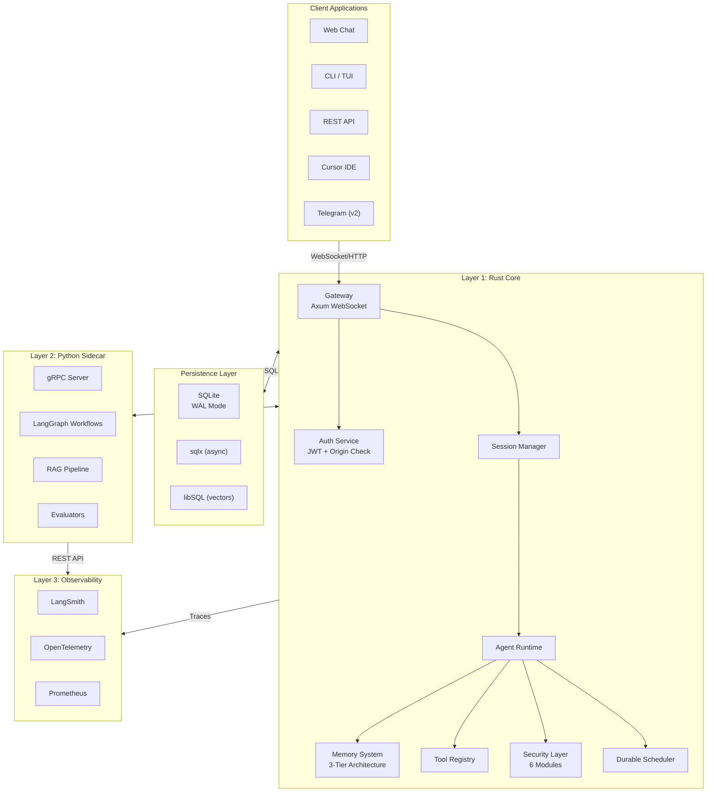
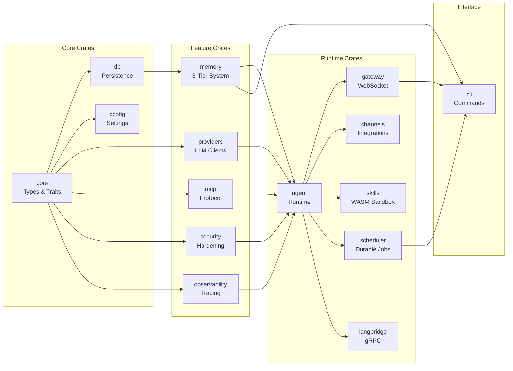
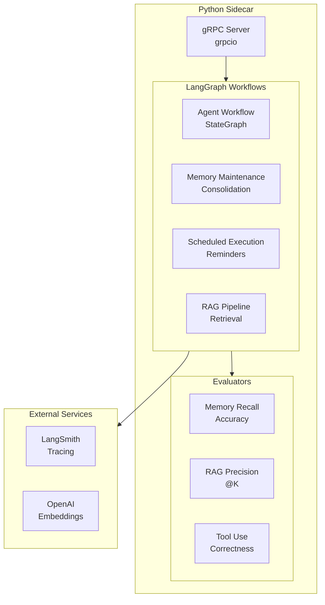
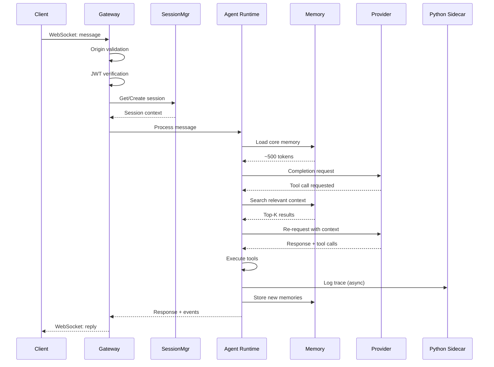
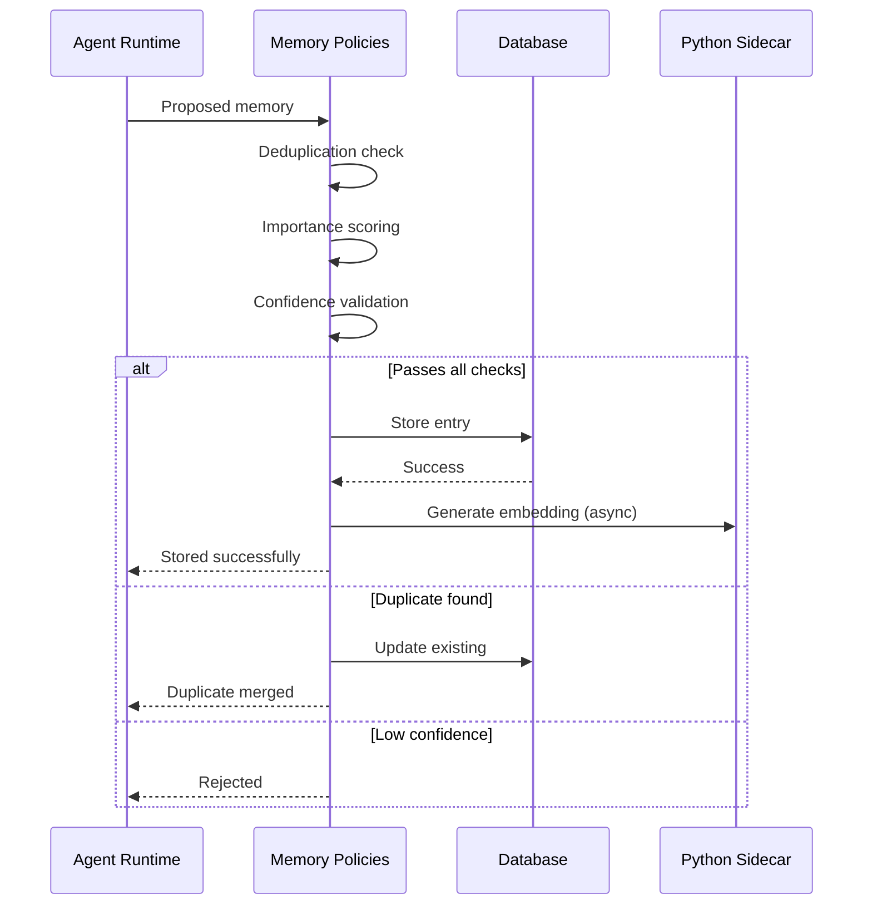
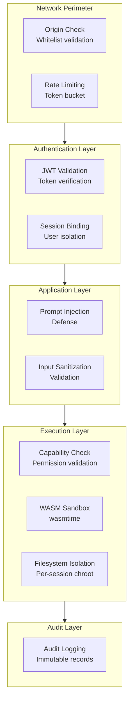
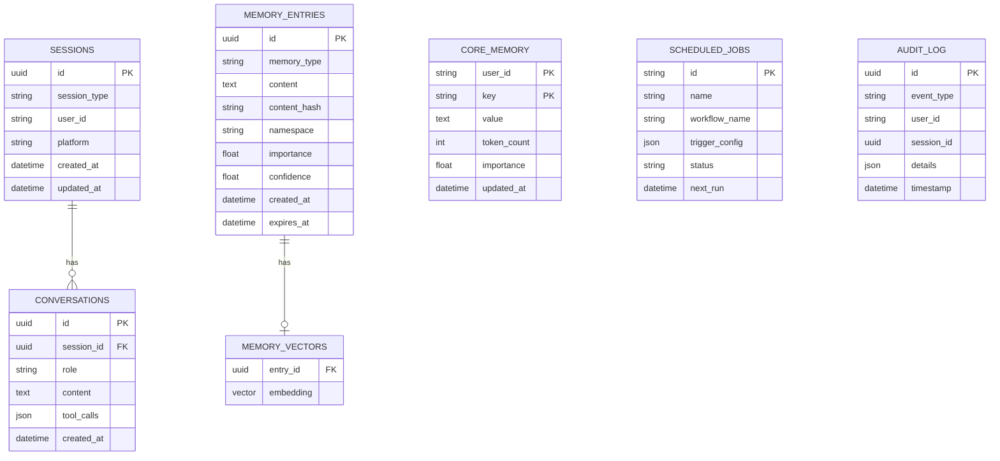
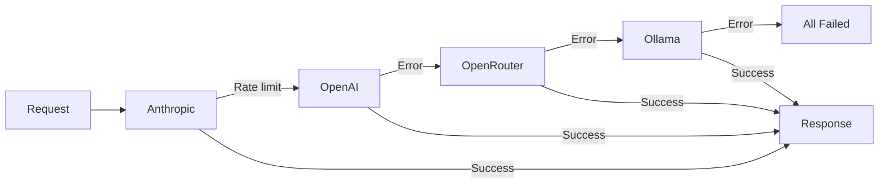
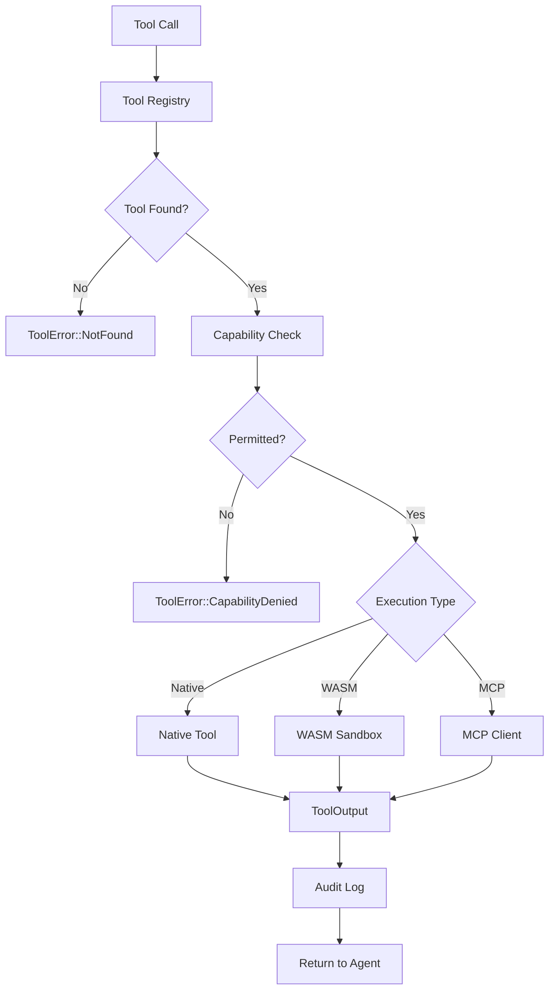
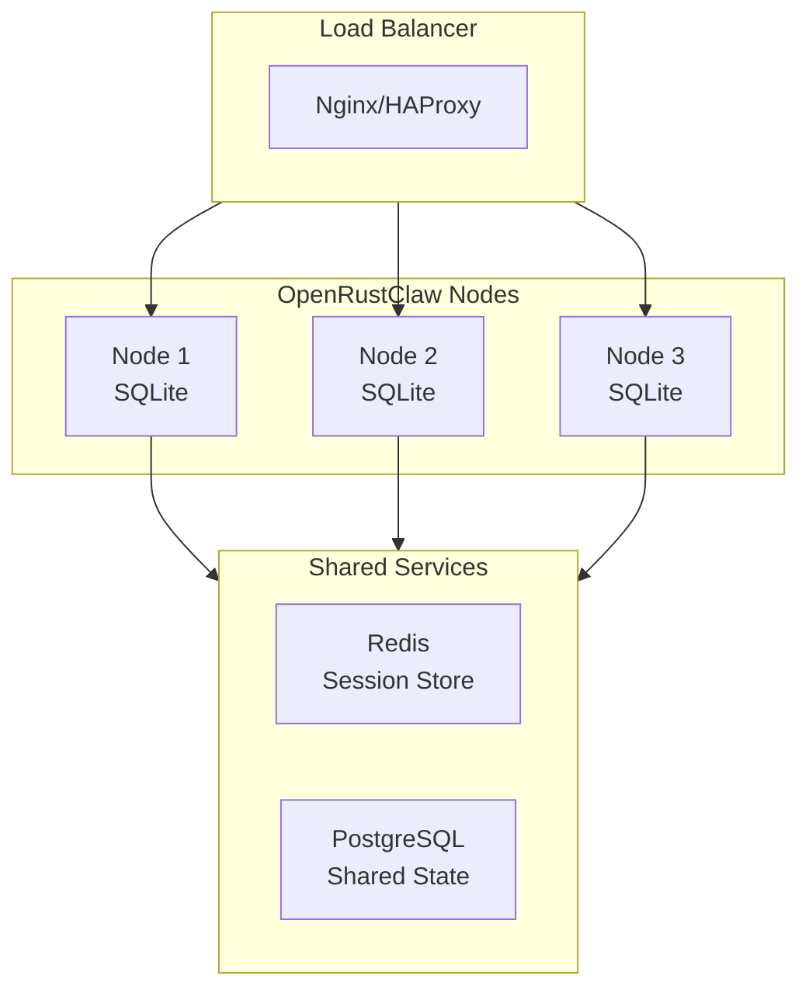

# Architecture Overview

This document provides a comprehensive overview of OpenRustClaw's architecture, explaining the design decisions, data flow, and component interactions.

---

## 🏗️ High-Level Architecture

OpenRustClaw follows a **three-layer architecture** that combines Rust's performance with Python's AI ecosystem:

---

## 📊 Layer 1: Rust Core (14 Crates)

The Rust Core is the heart of OpenRustClaw, handling all synchronous operations, WebSocket connections, and high-throughput tasks.

### Crate Responsibilities

| Crate | Purpose | Key Dependencies |
|-------|---------|------------------|
| `core` | Shared types, traits, errors | `serde`, `uuid`, `chrono` |
| `db` | SQLite persistence | `sqlx`, `libsql`, `rusqlite` |
| `memory` | 3-tier memory + RAG | `db`, `tiktoken-rs` |
| `providers` | LLM provider SDKs | `reqwest`, `tokio` |
| `mcp` | MCP client/server | `jsonschema`, `tower` |
| `security` | Auth, sandbox, audit | `ed25519-dalek`, `wasmtime` |
| `agent` | Runtime, tool registry | All above |
| `gateway` | Axum WebSocket server | `axum`, `tower-http` |
| `scheduler` | Durable job scheduling | `cron`, `chrono-tz` |
| `langbridge` | gRPC to Python | `tonic`, `prost` |
| `observability` | LangSmith, tracing | `opentelemetry`, `tracing` |
| `cli` | Command-line interface | `clap`, `ratatui` |

---

## 🐍 Layer 2: Python LangGraph Sidecar

The Python sidecar handles AI orchestration, complex workflows, and maintenance tasks.

### Workflow Types

1. **Agent Workflow** — Main conversation loop with tool use
2. **Memory Maintenance** — Consolidation, deduplication, pruning
3. **Scheduled Execution** — Durable job processing
4. **RAG Pipeline** — Document ingestion and retrieval

---

## 🔄 Data Flow

### Typical Request Flow

### Memory Write Flow

---

## 🔒 Security Boundaries

---

## 🗄️ Persistence Architecture

### Database Schema Overview

### Database Access Patterns

| Crate | Access Pattern | Library |
|-------|---------------|---------|
| `gateway` | Read/write sessions | `sqlx` |
| `memory` | Read/write entries, search | `sqlx` + `libsql` |
| `db` | Migrations, core memory | `rusqlite` |
| `scheduler` | Job scheduling | `sqlx` |
| `security` | Audit logging | `sqlx` |

---

## 🔌 Component Interactions

### Provider Fallback Chain

### Tool Execution Flow

---

## 📊 Scalability Considerations

### Vertical Scaling (Single Node)

- **SQLite WAL mode** enables concurrent reads
- **Async throughout** with Tokio runtime
- **Bounded concurrency** for embeddings
- **Connection pooling** via `sqlx`

### Horizontal Scaling (Future)

---

## 🎯 Design Principles

### 1. **Security First**
- All connections authenticated
- All inputs sanitized
- All skills verified
- All actions audited

### 2. **Recall-Only Memory**
- Never inject large files into prompts
- Agent must actively search for context
- Reduces token waste by ~90%

### 3. **Durable Execution**
- No cron jobs
- Distributed leases for scheduling
- Idempotency keys prevent duplicates

### 4. **Provider Agnostic**
- Support multiple LLM providers
- Automatic fallback chains
- Native SDK compliance

### 5. **Observability Built-In**
- Every operation traced
- Every decision logged
- Offline eval datasets

---

## 🛠️ Technology Stack

### Backend (Rust)
- **Runtime**: Tokio (async)
- **HTTP**: Axum, reqwest
- **Serialization**: serde, prost (gRPC)
- **Database**: sqlx, libSQL, rusqlite
- **Sandbox**: wasmtime (WASM)
- **Crypto**: ed25519-dalek

### Sidecar (Python)
- **Orchestration**: LangGraph
- **Observability**: LangSmith
- **gRPC**: grpcio

### Infrastructure
- **Container**: Docker, Kubernetes
- **Observability**: Prometheus, Grafana, OpenTelemetry
- **Messaging**: gRPC, NATS (optional)

---

## 🌐 Distributed Mode (Future)

Horizontal scaling capabilities planned for future releases:
- Raft consensus for leader election
- Gossip protocol for service discovery
- Distributed memory (Redis/etcd)
- Load balancing (round-robin, consistent hashing)
- Session affinity

---

## 📚 Related Documentation

- [Rust Core Deep Dive](./rust-core.md) — All 14 crates explained
- [LangGraph Sidecar](./langgraph-sidecar.md) — Python orchestration
- [Memory & RAG](./memory-rag.md) — 3-tier memory system
- [Security Architecture](../guides/security.md) — Security deep dive
