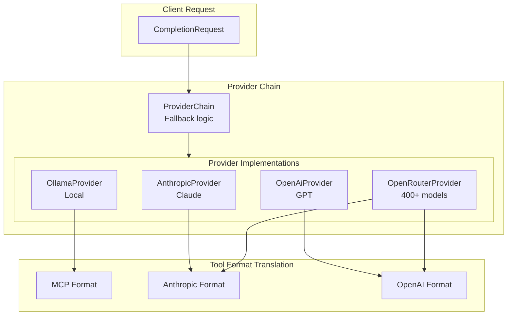

# Provider SDKs Architecture

OpenRustClaw supports multiple LLM providers with native SDK compliance, automatic fallback chains, and standardized tool formats.

## Coverage Snapshot

- First-class provider SDK crates live under the workspace `crates/` tree alongside the shared `openrustclaw-providers` layer.
- Common operator defaults center on Anthropic, OpenAI, OpenRouter, and Ollama.
- Additional maintained provider SDK crates cover AI21, Azure OpenAI, AWS Bedrock, Cloudflare AI, Cohere, DeepSeek, Fireworks, Gemini, Groq, llama.cpp, Perplexity, Replicate, Together AI, and vLLM.
- Use this page for architecture and fallback behavior; use each crate README for package-specific quick starts.

---

## 🎯 Provider Architecture



---

## 🔗 Provider Chain

The `ProviderChain` manages automatic failover between providers:

```rust
pub struct ProviderChain {
    providers: Vec<Arc<dyn LlmProvider>>,
    cooldowns: Arc<DashMap<String, (Instant, Duration)>>,
    metrics: Arc<ProviderMetrics>,
}

impl ProviderChain {
    pub async fn complete(&self, request: CompletionRequest) -> Result<CompletionResponse> {
        let start = Instant::now();
        
        for (idx, provider) in self.providers.iter().enumerate() {
            let provider_name = provider.provider_name();
            
            // Check cooldown
            if self.is_in_cooldown(provider_name) {
                tracing::debug!("Provider {} in cooldown, skipping", provider_name);
                continue;
            }
            
            tracing::info!("Trying provider: {}", provider_name);
            
            match provider.complete(request.clone()).await {
                Ok(response) => {
                    self.metrics.record_success(provider_name, start.elapsed());
                    
                    // Add fallback metadata
                    let mut response = response;
                    response.provider = provider_name.to_string();
                    response.fallback_index = idx;
                    
                    return Ok(response);
                }
                Err(Error::Provider(ProviderError::RateLimited { retry_after_secs, .. })) => {
                    tracing::warn!("Provider {} rate limited", provider_name);
                    self.set_cooldown(provider_name, retry_after_secs);
                    self.metrics.record_rate_limit(provider_name);
                    continue;
                }
                Err(Error::Provider(ProviderError::AuthFailed { .. })) => {
                    tracing::error!("Provider {} auth failed - permanent failure", provider_name);
                    self.set_cooldown(provider_name, None); // Indefinite
                    self.metrics.record_auth_failure(provider_name);
                    continue;
                }
                Err(e) => {
                    tracing::warn!("Provider {} error: {}", provider_name, e);
                    self.metrics.record_error(provider_name, &e);
                    continue;
                }
            }
        }
        
        Err(Error::Provider(ProviderError::AllProvidersExhausted))
    }
}
```

### Cooldown Management

```rust
impl ProviderChain {
    fn is_in_cooldown(&self, provider: &str) -> bool {
        if let Some((start, duration)) = self.cooldowns.get(provider) {
            if let Some(d) = duration {
                return start.elapsed() < *d;
            }
            return true; // Indefinite cooldown
        }
        false
    }
    
    fn set_cooldown(&self, provider: &str, duration: Option<u64>) {
        let cooldown = duration.map(Duration::from_secs);
        self.cooldowns.insert(provider.to_string(), (Instant::now(), cooldown));
    }
}
```

---

## 🤖 Provider Implementations

### Anthropic Provider

```rust
pub struct AnthropicProvider {
    client: reqwest::Client,
    api_key: String,
    model: String,
    base_url: String,
}

#[async_trait]
impl LlmProvider for AnthropicProvider {
    async fn complete(&self, request: CompletionRequest) -> Result<CompletionResponse> {
        let anthropic_request = AnthropicRequest {
            model: self.model.clone(),
            max_tokens: request.max_tokens.unwrap_or(4096),
            messages: convert_messages(&request.messages),
            system: request.system_prompt,
            tools: request.tools.map(|t| convert_tools(t, ToolFormat::Anthropic)),
            tool_choice: Some(ToolChoice::Auto),
        };
        
        let response = self.client
            .post(format!("{}/v1/messages", self.base_url))
            .header("x-api-key", &self.api_key)
            .header("anthropic-version", "2023-06-01")
            .header("content-type", "application/json")
            .json(&anthropic_request)
            .send()
            .await?;
        
        match response.status() {
            StatusCode::OK => {
                let body: AnthropicResponse = response.json().await?;
                Ok(convert_response(body))
            }
            StatusCode::TOO_MANY_REQUESTS => {
                let retry_after = response.headers()
                    .get("retry-after")
                    .and_then(|v| v.to_str().ok())
                    .and_then(|v| v.parse().ok());
                Err(Error::Provider(ProviderError::RateLimited {
                    provider: "anthropic".into(),
                    retry_after_secs: retry_after,
                }))
            }
            StatusCode::UNAUTHORIZED => {
                Err(Error::Provider(ProviderError::AuthFailed {
                    provider: "anthropic".into(),
                    message: "Invalid API key".into(),
                }))
            }
            status => {
                let error_text = response.text().await?;
                Err(Error::Provider(ProviderError::Request(format!(
                    "HTTP {}: {}", status, error_text
                ))))
            }
        }
    }
    
    fn model_id(&self) -> &str { &self.model }
    fn provider_name(&self) -> &str { "anthropic" }
    fn supports_strict_tools(&self) -> bool { true }
    fn native_tool_format(&self) -> ToolFormat { ToolFormat::Anthropic }
}
```

### OpenAI Provider

```rust
pub struct OpenAiProvider {
    client: reqwest::Client,
    api_key: String,
    model: String,
    use_responses_api: bool,  // New Responses API vs Chat Completions
}

#[async_trait]
impl LlmProvider for OpenAiProvider {
    async fn complete(&self, request: CompletionRequest) -> Result<CompletionResponse> {
        if self.use_responses_api {
            self.complete_responses_api(request).await
        } else {
            self.complete_chat_completions(request).await
        }
    }
    
    async fn complete_responses_api(&self, request: CompletionRequest) -> Result<CompletionResponse> {
        let openai_request = OpenAiResponseRequest {
            model: self.model.clone(),
            input: convert_input(&request.messages),
            tools: request.tools.map(|t| convert_tools(t, ToolFormat::OpenAi)),
            tool_choice: Some("auto".into()),
            max_output_tokens: request.max_tokens,
            temperature: request.temperature,
            // Enable strict mode for guaranteed schema compliance
            strict: true,
        };
        
        let response = self.client
            .post("https://api.openai.com/v1/responses")
            .header("Authorization", format!("Bearer {}", self.api_key))
            .json(&openai_request)
            .send()
            .await?;
        
        // Handle response similar to Anthropic...
        let body: OpenAiResponse = response.json().await?;
        Ok(convert_openai_response(body))
    }
    
    fn model_id(&self) -> &str { &self.model }
    fn provider_name(&self) -> &str { "openai" }
    fn supports_strict_tools(&self) -> bool { true }
    fn native_tool_format(&self) -> ToolFormat { ToolFormat::OpenAi }
}
```

### OpenRouter Provider

```rust
pub struct OpenRouterProvider {
    client: reqwest::Client,
    api_key: String,
    model: String,
    site_url: String,
    site_name: String,
}

#[async_trait]
impl LlmProvider for OpenRouterProvider {
    async fn complete(&self, request: CompletionRequest) -> Result<CompletionResponse> {
        // OpenRouter uses OpenAI-compatible format
        let or_request = OpenRouterRequest {
            model: self.model.clone(),
            messages: convert_messages(&request.messages),
            tools: request.tools.map(|t| convert_tools(t, ToolFormat::OpenAi)),
            temperature: request.temperature,
            max_tokens: request.max_tokens,
        };
        
        let response = self.client
            .post("https://openrouter.ai/api/v1/chat/completions")
            .header("Authorization", format!("Bearer {}", self.api_key))
            .header("HTTP-Referer", &self.site_url)  // Required by OpenRouter TOS
            .header("X-Title", &self.site_name)
            .json(&or_request)
            .send()
            .await?;
        
        // OpenRouter returns usage info including cost
        let body: OpenRouterResponse = response.json().await?;
        
        Ok(CompletionResponse {
            id: body.id,
            message: convert_message(body.choices[0].message),
            model: body.model,
            usage: TokenUsage {
                prompt_tokens: body.usage.prompt_tokens,
                completion_tokens: body.usage.completion_tokens,
                total_tokens: body.usage.total_tokens,
                cost_usd: body.usage.cost,  // OpenRouter provides cost
            },
            provider: "openrouter".into(),
            finish_reason: convert_finish_reason(body.choices[0].finish_reason),
        })
    }
    
    fn model_id(&self) -> &str { &self.model }
    fn provider_name(&self) -> &str { "openrouter" }
    fn supports_strict_tools(&self) -> bool { 
        // Depends on underlying model
        self.model.starts_with("anthropic/")
    }
    fn native_tool_format(&self) -> ToolFormat { ToolFormat::OpenAi }
}
```

### Ollama Provider

```rust
pub struct OllamaProvider {
    client: reqwest::Client,
    base_url: String,
    model: String,
}

#[async_trait]
impl LlmProvider for OllamaProvider {
    async fn complete(&self, request: CompletionRequest) -> Result<CompletionResponse> {
        let ollama_request = OllamaRequest {
            model: self.model.clone(),
            messages: convert_messages(&request.messages),
            stream: false,
            tools: request.tools.map(|t| convert_tools(t, ToolFormat::Mcp)),
            options: OllamaOptions {
                temperature: request.temperature,
                num_predict: request.max_tokens,
            },
        };
        
        let response = self.client
            .post(format!("{}/api/chat", self.base_url))
            .json(&ollama_request)
            .send()
            .await?;
        
        // Ollama has a quirk where tool_call deltas come as content
        // We need to buffer and fix this
        let body: OllamaResponse = response.json().await?;
        let fixed_message = fix_ollama_tool_calls(body.message);
        
        Ok(CompletionResponse {
            id: format!("ollama-{}", uuid::Uuid::new_v4()),
            message: fixed_message,
            model: body.model,
            usage: TokenUsage {
                prompt_tokens: body.prompt_eval_count,
                completion_tokens: body.eval_count,
                total_tokens: body.prompt_eval_count + body.eval_count,
                cost_usd: Some(0.0),  // Local = free
            },
            provider: "ollama".into(),
            finish_reason: FinishReason::Stop,
        })
    }
    
    fn model_id(&self) -> &str { &self.model }
    fn provider_name(&self) -> &str { "ollama" }
    fn supports_strict_tools(&self) -> bool { false }
    fn native_tool_format(&self) -> ToolFormat { ToolFormat::Mcp }
}

// Fix Ollama's tool call streaming quirk
fn fix_ollama_tool_calls(message: Message) -> Message {
    // Ollama sometimes returns tool calls as content instead of tool_calls field
    if let Some(content) = &message.content {
        if content.starts_with("{\"tool_call\":") {
            if let Ok(tool_call) = serde_json::from_str::<ToolCall>(content) {
                return Message {
                    content: None,
                    tool_calls: Some(vec![tool_call]),
                    ..message
                };
            }
        }
    }
    message
}
```

---

## 🛠️ Tool Format Translation

Each provider expects tools in a different format. OpenRustClaw automatically translates:

```rust
pub enum ToolFormat {
    Mcp,        // Model Context Protocol
    Anthropic,  // Anthropic's tool format
    OpenAi,     // OpenAI's function calling
}

pub fn translate_tool_definition(
    tool: &ToolDefinition,
    target_format: ToolFormat,
) -> Value {
    match target_format {
        ToolFormat::Mcp => serde_json::json!({
            "name": tool.name,
            "description": tool.description,
            "inputSchema": tool.parameters,
        }),
        ToolFormat::Anthropic => serde_json::json!({
            "name": tool.name,
            "description": tool.description,
            "input_schema": tool.parameters,
        }),
        ToolFormat::OpenAi => serde_json::json!({
            "type": "function",
            "function": {
                "name": tool.name,
                "description": tool.description,
                "parameters": tool.parameters,
                "strict": tool.strict,
            },
        }),
    }
}
```

---

## 📊 Streaming Implementation

All providers support streaming for real-time responses:

```rust
#[async_trait]
pub trait LlmProvider: Send + Sync {
    async fn stream(
        &self,
        request: CompletionRequest,
    ) -> Result<Pin<Box<dyn Stream<Item = Result<StreamChunk>> + Send>>>;
}

// Anthropic streaming implementation
impl AnthropicProvider {
    async fn stream_inner(&self, request: CompletionRequest) -> Result<impl Stream<Item = Result<StreamChunk>>> {
        let response = self.client
            .post(format!("{}/v1/messages", self.base_url))
            .header("x-api-key", &self.api_key)
            .header("anthropic-version", "2023-06-01")
            .json(&AnthropicRequest {
                stream: true,
                ..convert_request(request)
            })
            .send()
            .await?;
        
        let stream = response
            .bytes_stream()
            .eventsource()
            .map(|event| {
                let event = event?;
                match event.event.as_str() {
                    "content_block_delta" => {
                        let delta: ContentDelta = serde_json::from_str(&event.data)?;
                        Ok(StreamChunk::ContentDelta { delta: delta.text })
                    }
                    "content_block_start" if delta.is_tool_call => {
                        let tool: ToolCallDelta = serde_json::from_str(&event.data)?;
                        Ok(StreamChunk::ToolCallDelta {
                            id: tool.id,
                            name: Some(tool.name),
                            arguments_delta: tool.partial_json,
                        })
                    }
                    "message_stop" => {
                        Ok(StreamChunk::Done { response: assemble_response() })
                    }
                    _ => Ok(StreamChunk::ContentDelta { delta: String::new() }),
                }
            });
        
        Ok(stream)
    }
}
```

---

## 📈 Provider SDK Compliance

| Provider | SDK | Required Headers | TOS Requirements |
|----------|-----|------------------|------------------|
| Anthropic | `anthropic` (planned) | `x-api-key`, `anthropic-version` | No competing AI products |
| OpenAI | `async-openai` (planned) | `Authorization: Bearer` | No competing AI models |
| OpenRouter | `openrouter-api` (planned) | `Authorization: Bearer`, `HTTP-Referer` | Zero logging default |
| Ollama | Raw HTTP | None | N/A |

### Header Compliance

```rust
// Anthropic required headers
let response = client
    .post("https://api.anthropic.com/v1/messages")
    .header("x-api-key", api_key)
    .header("anthropic-version", "2023-06-01")
    .header("content-type", "application/json")
    .send();

// OpenAI required headers
let response = client
    .post("https://api.openai.com/v1/responses")
    .header("Authorization", format!("Bearer {}", api_key))
    .send();

// OpenRouter required headers (per TOS)
let response = client
    .post("https://openrouter.ai/api/v1/chat/completions")
    .header("Authorization", format!("Bearer {}", api_key))
    .header("HTTP-Referer", "https://openrustclaw.dev")  // Required
    .header("X-Title", "OpenRustClaw")  // Required
    .send();
```

---

## 🎯 Best Practices

### 1. Configure Multiple Providers

```toml
[providers]
primary = "anthropic"
fallback_chain = ["openai", "openrouter", "ollama"]

[providers.anthropic]
api_key = "${ANTHROPIC_API_KEY}"
model = "claude-sonnet-4-20250514"

[providers.openai]
api_key = "${OPENAI_API_KEY}"
model = "gpt-4o"

[providers.openrouter]
api_key = "${OPENROUTER_API_KEY}"
model = "anthropic/claude-3.5-sonnet"
```

### 2. Set Appropriate Timeouts

```rust
ProviderChain::builder()
    .add_provider(anthropic)
    .add_provider(openai)
    .timeout(Duration::from_secs(30))
    .build()
```

### 3. Monitor Fallback Frequency

```rust
// High fallback frequency may indicate:
// - Primary provider rate limits too low
// - Need to upgrade plan
// - Need to implement request batching

metrics.record_fallback(provider_name, fallback_reason);
```

### 4. Use Strict Tools When Available

```rust
if provider.supports_strict_tools() {
    // Enable guaranteed schema compliance
    request.strict = true;
}
```
