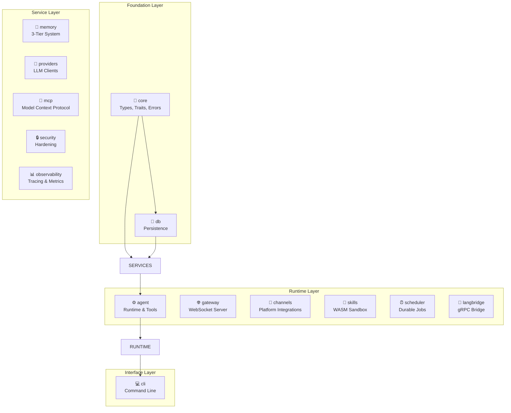
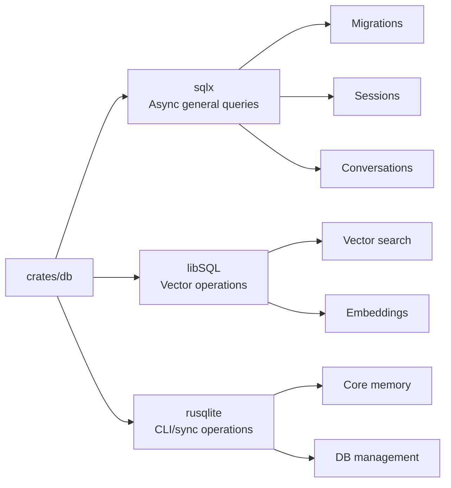
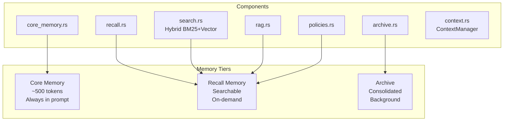
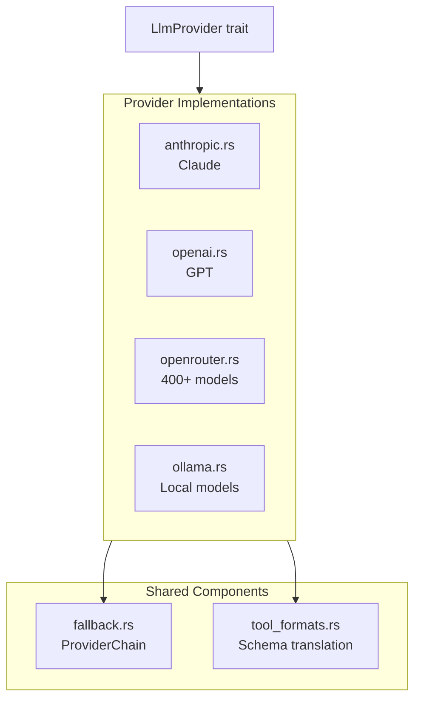
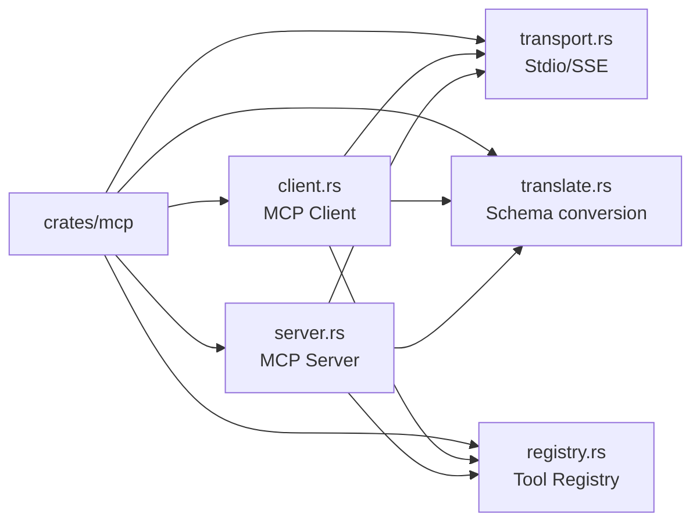
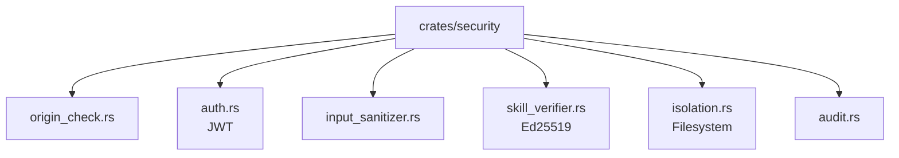
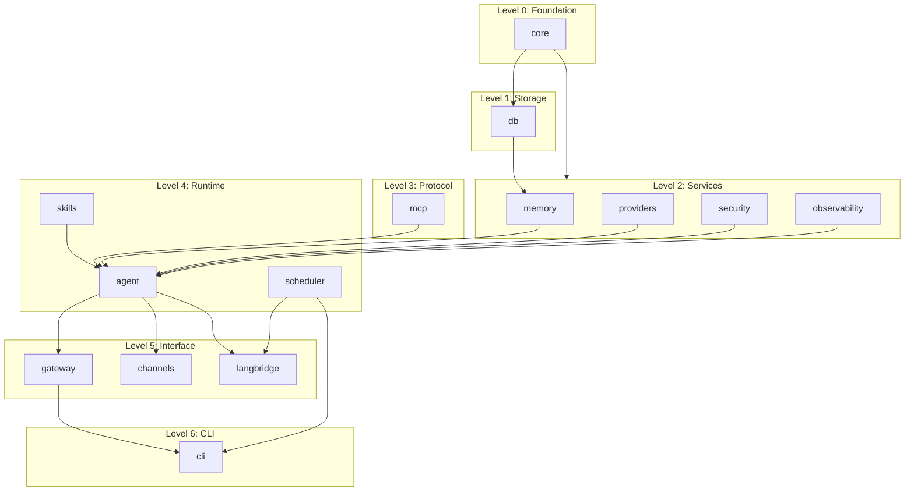

# Rust Core Architecture

This document provides a comprehensive deep dive into all 14 crates that make up the OpenRustClaw Rust core.

---

## 📦 Crate Overview



---

## 🔧 `crates/core` — Foundation Types

The `core` crate defines all shared types, traits, and errors used across the workspace.

### Module Structure

```
crates/core/src/
├── lib.rs          # Crate re-exports
├── types.rs        # All data types (Message, Session, MemoryEntry, etc.)
├── traits.rs       # Core trait definitions (LlmProvider, Tool, MemoryStore, etc.)
├── error.rs        # Unified error types with thiserror
└── config.rs       # Configuration structures
```

### Key Types

#### Messages

```rust
/// A single message in a conversation.
#[derive(Debug, Clone, Serialize, Deserialize)]
pub struct Message {
    pub id: Uuid,
    pub role: Role,  // User, Assistant, System, Tool
    pub content: String,
    pub tool_calls: Option<Vec<ToolCall>>,
    pub tool_call_id: Option<String>,
    pub token_count: Option<usize>,
    pub created_at: DateTime<Utc>,
}

impl Message {
    pub fn user(content: impl Into<String>) -> Self { ... }
    pub fn assistant(content: impl Into<String>) -> Self { ... }
    pub fn tool(tool_call_id: impl Into<String>, content: impl Into<String>) -> Self { ... }
}
```

#### Sessions

```rust
pub struct Session {
    pub id: Uuid,
    pub session_type: SessionType,  // Dm, Group, Isolated
    pub user_id: String,
    pub channel: Platform,  // WebChat, Telegram, Discord, etc.
    pub workspace_id: Option<String>,
    pub created_at: DateTime<Utc>,
    pub updated_at: DateTime<Utc>,
    pub metadata: serde_json::Value,
}
```

#### Memory Types

```rust
pub enum MemoryType {
    Episodic,    // Events, conversations
    Semantic,    // Facts, knowledge
    Procedural,  // How-to, workflows
}

pub struct MemoryEntry {
    pub id: Uuid,
    pub memory_type: MemoryType,
    pub content: String,
    pub content_hash: String,  // SHA-256 for deduplication
    pub namespace: String,
    pub importance: f32,       // 0.0 - 1.0
    pub confidence: f32,       // 0.0 - 1.0
    pub access_count: u32,
    pub last_accessed: Option<DateTime<Utc>>,
    pub created_at: DateTime<Utc>,
    pub expires_at: Option<DateTime<Utc>>,
}
```

---

## 🎯 Core Traits

### `LlmProvider` — LLM Abstraction

```rust
#[async_trait]
pub trait LlmProvider: Send + Sync {
    /// Send a completion request and return the full response
    async fn complete(&self, request: CompletionRequest) -> Result<CompletionResponse>;

    /// Send a completion request and return a stream of chunks
    async fn stream(&self, request: CompletionRequest) 
        -> Result<Pin<Box<dyn Stream<Item = Result<StreamChunk>> + Send>>>;

    fn model_id(&self) -> &str;
    fn max_tokens(&self) -> usize;
    fn provider_name(&self) -> &str;
    fn supports_strict_tools(&self) -> bool;
    fn native_tool_format(&self) -> ToolFormat;
}
```

### `Tool` — Tool Abstraction

```rust
#[async_trait]
pub trait Tool: Send + Sync {
    fn name(&self) -> &str;
    fn description(&self) -> &str;
    fn schema(&self) -> Value;  // JSON Schema
    fn capabilities_required(&self) -> Vec<SkillCapability>;
    async fn execute(&self, input: Value, ctx: &ToolContext) -> Result<ToolOutput>;
}

pub struct ToolContext {
    pub session_id: String,
    pub user_id: String,
    pub workspace_path: Option<String>,
}
```

### `MemoryStore` — Recall Memory Backend

```rust
#[async_trait]
pub trait MemoryStore: Send + Sync {
    async fn store(&self, entry: MemoryEntry) -> Result<()>;
    async fn search(&self, query: &MemoryQuery) -> Result<Vec<ScoredMemory>>;
    async fn get(&self, id: &str) -> Result<Option<MemoryEntry>>;
    async fn delete(&self, id: &str) -> Result<()>;
    async fn dedupe_check(&self, content_hash: &str) -> Result<Option<String>>;
    async fn expire_stale(&self) -> Result<u64>;
}
```

### `CoreMemoryStore` — Core Memory Backend

```rust
#[async_trait]
pub trait CoreMemoryStore: Send + Sync {
    async fn get_all(&self, user_id: &str) -> Result<Vec<CoreEntry>>;
    async fn set(&self, user_id: &str, entry: CoreEntry) -> Result<()>;
    async fn remove(&self, user_id: &str, key: &str) -> Result<()>;
    async fn render(&self, user_id: &str) -> Result<String>;
    async fn total_tokens(&self, user_id: &str) -> Result<usize>;
}
```

---

## 🚨 Error Handling

OpenRustClaw uses `thiserror` for library errors with structured variants:

```rust
#[derive(Debug, Error)]
pub enum Error {
    #[error("Provider error: {0}")]
    Provider(#[from] ProviderError),
    
    #[error("Database error: {0}")]
    Database(#[from] DatabaseError),
    
    #[error("Memory error: {0}")]
    Memory(#[from] MemoryError),
    
    #[error("Security error: {0}")]
    Security(#[from] SecurityError),
    // ...
}

#[derive(Debug, Error)]
pub enum ProviderError {
    #[error("Rate limited by {provider} (retry after {retry_after_secs:?}s)")]
    RateLimited { provider: String, retry_after_secs: Option<u64> },
    
    #[error("Authentication failed for {provider}: {message}")]
    AuthFailed { provider: String, message: String },
    
    #[error("All providers in fallback chain exhausted")]
    AllProvidersExhausted,
    // ...
}
```

---

## 💾 `crates/db` — Persistence Layer

The `db` crate manages all database access with three SQLite libraries for different use cases:



### Database Schema (12 Migrations)

| Table | Purpose |
|-------|---------|
| `sessions` | Session metadata |
| `conversations` | Message history |
| `memory_entries` | Recall memory storage |
| `memory_fts` | Full-text search index |
| `memory_vectors` | Vector embeddings (libSQL) |
| `core_memory` | Key-value core memory |
| `memory_archive` | Consolidated summaries |
| `skills` | Skill registry |
| `audit_log` | Security audit trail |
| `scheduled_jobs` | Job definitions |
| `job_runs` | Job execution history |
| `dead_letter_queue` | Failed job storage |
| `workflow_checkpoints` | LangGraph persistence |

---

## 🧠 `crates/memory` — 3-Tier Memory



### Hybrid Search Algorithm

```rust
pub async fn hybrid_search(
    &self,
    query: &MemoryQuery,
) -> Result<Vec<ScoredMemory>> {
    // 1. BM25 text search
    let bm25_results = self.bm25_search(&query.text).await?;
    
    // 2. Vector similarity search
    let query_embedding = self.embed(&query.text).await?;
    let vector_results = self.vector_search(&query_embedding).await?;
    
    // 3. Reciprocal Rank Fusion (RRF)
    let fused = reciprocal_rank_fusion(bm25_results, vector_results);
    
    // 4. Maximal Marginal Relevance (MMR) for diversity
    let diverse = mm_rerank(fused, query.diversity_lambda);
    
    // 5. Temporal decay boost
    let scored = apply_temporal_decay(diverse, query.recency_weight);
    
    Ok(scored)
}
```

---

## 🤖 `crates/providers` — LLM Provider SDKs



### Provider Chain Fallback

```rust
pub struct ProviderChain {
    providers: Vec<Arc<dyn LlmProvider>>,
    cooldowns: Arc<DashMap<String, Instant>>,
}

impl ProviderChain {
    pub async fn complete(&self, request: CompletionRequest) -> Result<CompletionResponse> {
        for provider in &self.providers {
            if self.is_cooled_down(provider.provider_name()) {
                continue;
            }
            
            match provider.complete(request.clone()).await {
                Ok(response) => return Ok(response),
                Err(Error::Provider(ProviderError::RateLimited { retry_after_secs, .. })) => {
                    self.set_cooldown(provider.provider_name(), retry_after_secs);
                    continue;
                }
                Err(Error::Provider(ProviderError::AuthFailed { .. })) => {
                    // Auth failures are permanent, skip
                    continue;
                }
                Err(e) => {
                    tracing::warn!("Provider error: {}", e);
                    continue;
                }
            }
        }
        
        Err(Error::Provider(ProviderError::AllProvidersExhausted))
    }
}
```

---

## 🔌 `crates/mcp` — Model Context Protocol



### MCP Client

Connects to external MCP servers (e.g., filesystem, GitHub, databases):

```rust
pub struct McpClient {
    transport: Box<dyn McpTransport>,
    tools: Vec<ToolDefinition>,
}

impl McpClient {
    pub async fn connect(&mut self) -> Result<()> {
        // Initialize session
        self.transport.send(Request::Initialize { ... }).await?;
        
        // List available tools
        let response = self.transport.send(Request::ToolsList).await?;
        self.tools = response.tools;
        
        Ok(())
    }
    
    pub async fn call_tool(&self, name: &str, arguments: Value) -> Result<ToolOutput> {
        self.transport.send(Request::ToolCall { name, arguments }).await
    }
}
```

### MCP Server

Exposes OpenRustClaw tools to external clients (Claude Desktop, Cursor):

```rust
pub struct McpServer {
    tool_registry: Arc<ToolRegistry>,
}

impl McpServer {
    pub async fn run(self, transport: impl McpTransport) -> Result<()> {
        // Handle incoming requests
        while let Some(request) = transport.receive().await? {
            match request {
                Request::ToolsList => {
                    let tools = self.tool_registry.list_mcp_tools().await;
                    transport.send(Response::ToolsList(tools)).await?;
                }
                Request::ToolCall { name, arguments } => {
                    let output = self.tool_registry.call(&name, arguments).await?;
                    transport.send(Response::ToolResult(output)).await?;
                }
                // ...
            }
        }
        Ok(())
    }
}
```

---

## 🔒 `crates/security` — Security Hardening



### Origin Check

```rust
pub struct OriginChecker {
    allowed_origins: HashSet<String>,
}

impl OriginChecker {
    pub fn check(&self, origin: &str) -> Result<()> {
        if self.allowed_origins.contains(origin) {
            Ok(())
        } else {
            Err(Error::Security(SecurityError::InvalidOrigin { 
                origin: origin.to_string() 
            }))
        }
    }
}
```

### Skill Verification

```rust
pub struct SkillVerifier {
    trusted_keys: HashSet<VerifyingKey>,
}

impl SkillVerifier {
    pub fn verify(&self, skill: &Skill, signature: &[u8]) -> Result<()> {
        let verifying_key = self.trusted_keys.get(&skill.signer_key_id)
            .ok_or_else(|| Error::Security(SecurityError::SkillVerificationFailed(
                "Unknown signer".into()
            )))?;
        
        let signature = Signature::from_bytes(signature)
            .map_err(|e| Error::Security(SecurityError::SkillVerificationFailed(
                format!("Invalid signature format: {}", e)
            )))?;
        
        verifying_key.verify(&skill.canonical_bytes(), &signature)
            .map_err(|_| Error::Security(SecurityError::SkillVerificationFailed(
                "Signature verification failed".into()
            )))?;
        
        Ok(())
    }
}
```

---

## ⚙️ `crates/agent` — Runtime

The `agent` crate orchestrates the conversation loop:

```rust
pub struct AgentRuntime {
    provider: Arc<dyn LlmProvider>,
    tool_registry: Arc<ToolRegistry>,
    memory: Arc<dyn MemoryStore>,
    core_memory: Arc<dyn CoreMemoryStore>,
    context_manager: ContextManager,
    security: SecurityLayer,
}

impl AgentRuntime {
    pub async fn process_message(
        &self,
        session: &Session,
        message: Message,
    ) -> Result<AgentOutput> {
        // 1. Load conversation history
        let history = self.load_history(&session.id).await?;
        
        // 2. Load core memory
        let core_memory = self.core_memory.render(&session.user_id).await?;
        
        // 3. Build completion request
        let request = CompletionRequest {
            messages: self.build_prompt(&core_memory, &history, &message),
            tools: Some(self.tool_registry.definitions()),
            ..Default::default()
        };
        
        // 4. Get LLM response
        let response = self.provider.complete(request).await?;
        
        // 5. Handle tool calls
        if let Some(tool_calls) = &response.message.tool_calls {
            let tool_results = self.execute_tools(tool_calls, session).await?;
            
            // Re-request with tool results
            let final_response = self.provider.complete(
                self.build_followup_request(&response, &tool_results)
            ).await?;
            
            return Ok(AgentOutput::from_response(final_response));
        }
        
        Ok(AgentOutput::from_response(response))
    }
}
```

---

## 🌐 `crates/gateway` — WebSocket Server

```rust
pub struct GatewayServer {
    agent_runtime: Arc<AgentRuntime>,
    session_manager: Arc<SessionManager>,
    auth: AuthService,
    origin_checker: OriginChecker,
    rate_limiter: RateLimiter,
}

impl GatewayServer {
    pub async fn handle_websocket(
        &self,
        ws: WebSocketUpgrade,
        headers: HeaderMap,
    ) -> Result<Response> {
        // 1. Check origin
        let origin = headers.get("origin")
            .and_then(|v| v.to_str().ok())
            .ok_or(Error::Security(SecurityError::InvalidOrigin { 
                origin: "missing".into() 
            }))?;
        self.origin_checker.check(origin)?;
        
        // 2. Authenticate
        let token = headers.get("authorization")
            .and_then(|v| v.to_str().ok())
            .ok_or(Error::Security(SecurityError::AuthRequired))?;
        let user_id = self.auth.verify_token(token)?;
        
        // 3. Rate limit check
        self.rate_limiter.check(&user_id).await?;
        
        // 4. Upgrade to WebSocket
        Ok(ws.on_upgrade(move |socket| 
            self.handle_connection(socket, user_id)
        ))
    }
}
```

---

## ⏰ `crates/scheduler` — Durable Scheduling

```rust
pub struct SchedulerWorker {
    db: SqlitePool,
    langbridge: LangBridgeClient,
    lease_duration: Duration,
}

impl SchedulerWorker {
    pub async fn run(&self) -> Result<()> {
        loop {
            // 1. Poll for due jobs
            let due_jobs = self.get_due_jobs().await?;
            
            for job in due_jobs {
                // 2. Try to acquire lease
                if !self.try_acquire_lease(&job.id).await? {
                    continue;  // Another worker got it
                }
                
                // 3. Check idempotency
                if self.is_duplicate(&job.idempotency_key).await? {
                    continue;
                }
                
                // 4. Execute via sidecar
                match self.execute_workflow(&job).await {
                    Ok(_) => {
                        self.mark_success(&job.id).await?;
                    }
                    Err(e) if job.retry_count < job.max_retries => {
                        self.schedule_retry(&job, e).await?;
                    }
                    Err(e) => {
                        self.move_to_dead_letter(&job, e).await?;
                    }
                }
            }
            
            tokio::time::sleep(self.poll_interval).await;
        }
    }
}
```

---

## 🌉 `crates/langbridge` — gRPC Bridge

```rust
pub struct LangBridgeClient {
    orchestration_client: OrchestrationServiceClient<Channel>,
    tracing_client: TracingServiceClient<Channel>,
}

impl LangBridgeClient {
    pub async fn execute_workflow(
        &self,
        workflow_id: &str,
        input: Value,
    ) -> Result<WorkflowResponse> {
        let request = WorkflowRequest {
            workflow_id: workflow_id.to_string(),
            thread_id: Uuid::new_v4().to_string(),
            input: input.to_string(),
            metadata: HashMap::new(),
        };
        
        let response = self.orchestration_client
            .execute_workflow(request)
            .await?
            .into_inner();
        
        Ok(response)
    }
    
    pub async fn send_trace(&self, trace: LangSmithTrace) -> Result<()> {
        let request = TraceRequest {
            run_id: trace.run_id,
            name: trace.name,
            run_type: trace.run_type,
            inputs: trace.inputs.to_string(),
            outputs: trace.outputs.to_string(),
            // ...
        };
        
        self.tracing_client.send_trace(request).await?;
        Ok(())
    }
}
```

---

## 🎨 `crates/skills` — WASM Sandboxing

```rust
pub struct WasmSandbox {
    engine: wasmtime::Engine,
    linker: wasmtime::Linker<HostState>,
}

impl WasmSandbox {
    pub async fn execute(
        &self,
        wasm_module: &[u8],
        function: &str,
        input: Value,
    ) -> Result<Value> {
        // 1. Compile module
        let module = wasmtime::Module::new(&self.engine, wasm_module)?;
        
        // 2. Create isolated store with resource limits
        let mut store = wasmtime::Store::new(
            &self.engine,
            HostState {
                memory_limit: 128 * 1024 * 1024,  // 128MB
                fuel_limit: 10_000_000_000,       // ~10s of CPU
            },
        );
        
        // 3. Instantiate with capability-restricted imports
        let instance = self.linker.instantiate(&mut store, &module)?;
        
        // 4. Call function
        let func = instance.get_func(&mut store, function)
            .ok_or_else(|| Error::Tool(ToolError::NotFound(function.into())))?;
        
        let result = func.call(&mut store, &[input.into()], &mut [Val::null()])?;
        
        Ok(result[0].clone().into())
    }
}
```

---

## 📊 Dependency Graph



---

## 🏗️ Crate Build Order

```
1. core
2. db
3. memory, providers, security, observability
4. mcp
5. agent
6. gateway
7. channels, skills, scheduler
8. langbridge
9. cli
```

This order ensures that when building any crate, all its dependencies are already compiled.
