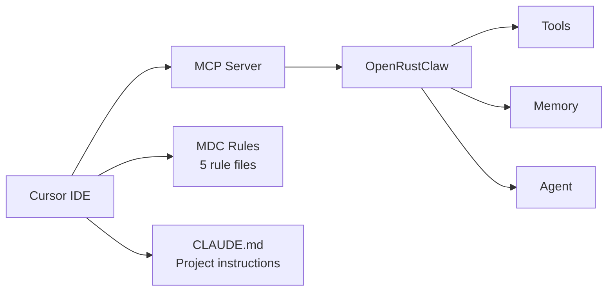

# Cursor IDE Integration

OpenRustClaw provides first-class integration with the Cursor IDE, allowing you to use OpenRustClaw tools directly from your editor.

---

## 🎯 Overview

The Cursor integration provides:

- **MCP Server Connection** — Access OpenRustClaw tools from Cursor
- **Rule Files** — 5 MDC files with Rust conventions and patterns
- **CLAUDE.md** — Project instructions for Claude Code



---

## 🚀 Setup

### Automatic Setup

```bash
# Generate all Cursor integration files
openrustclaw cursor setup

# This creates:
# - .cursor/mcp.json          # MCP server configuration
# - .cursor/rules/            # MDC rule files
#   - 01-rust-conventions.mdc
#   - 02-crate-architecture.mdc
#   - 03-provider-patterns.mdc
#   - 04-memory-patterns.mdc
#   - 05-testing-patterns.mdc
# - CLAUDE.md                 # Project instructions
```

### Manual Setup

#### 1. MCP Server Configuration

Create `.cursor/mcp.json`:

```json
{
  "mcpServers": {
    "openrustclaw": {
      "command": "openrustclaw",
      "args": ["mcp-server"],
      "env": {
        "DATABASE_URL": "sqlite:///path/to/openrustclaw.db",
        "ANTHROPIC_API_KEY": "${ANTHROPIC_API_KEY}"
      }
    }
  }
}
```

#### 2. Restart Cursor

After creating `mcp.json`, restart Cursor to load the MCP server.

---

## 🛠️ Using OpenRustClaw in Cursor

### Available Tools

Once connected, you can use these tools from Cursor:

| Tool | Description | Example |
|------|-------------|---------|
| `memory_search` | Search your memory | "Search my memory for Rust async patterns" |
| `memory_store` | Store information | "Remember that we use anyhow for errors" |
| `file_search` | Find files | "Find all test files" |
| `run_tests` | Execute tests | "Run the memory module tests" |

### Example Conversations

```
You: Search my memory for how we handle errors

Cursor: [memory_search] {"query": "error handling patterns"}

Based on your memory, you use:
1. thiserror for library errors
2. anyhow for application errors
3. Custom Error enum in core crate
```

```
You: Remember that we decided to use sqlx for database access

Cursor: [memory_store] {"content": "Using sqlx for database access with sqlite", "memory_type": "semantic"}

I've stored that information.
```

```
You: Find the provider implementation files

Cursor: [file_search] {"pattern": "**/providers/**/*.rs"}

Found provider implementations:
- crates/providers/src/anthropic.rs
- crates/providers/src/openai.rs
- crates/providers/src/openrouter.rs
- crates/providers/src/ollama.rs
```

---

## 📋 MDC Rule Files

The 5 MDC rule files provide context-aware assistance:

### 01-rust-conventions.mdc

```markdown
---
description: Rust coding conventions for OpenRustClaw
glob: "**/*.rs"
---

# Rust Conventions

## Error Handling
- Use `thiserror` for library errors (crates/*/src/error.rs)
- Use `anyhow` for CLI/application errors
- Custom Error enum in `crates/core/src/error.rs`

## Async
- All async functions use tokio
- Prefer `Arc<dyn Trait>` over generics for plugin boundaries
- Use `async-trait` for trait methods

## Logging
- Use `tracing` macros (info!, warn!, error!)
- Never use println! outside CLI crate
```

### 02-crate-architecture.mdc

```markdown
---
description: Crate architecture and dependencies
glob: "crates/**"
---

# Crate Architecture

## Dependency Order
```
core → db → memory, providers, mcp, observability, security → 
agent → gateway → channels → skills, scheduler → langbridge → cli
```

## Adding a New Crate
1. Create directory in `crates/`
2. Add to workspace `Cargo.toml`
3. Depend only on lower-level crates
4. Export public types in `lib.rs`

## Testing
- Unit tests in `src/` files
- Integration tests in `tests/integration/`
```

### 03-provider-patterns.mdc

```markdown
---
description: LLM provider implementation patterns
glob: "crates/providers/**/*.rs"
---

# Provider Patterns

## Implementing LlmProvider
```rust
#[async_trait]
impl LlmProvider for MyProvider {
    async fn complete(&self, request: CompletionRequest) -> Result<CompletionResponse>;
    fn native_tool_format(&self) -> ToolFormat;
}
```

## Required Headers
- Anthropic: `x-api-key`, `anthropic-version`
- OpenAI: `Authorization: Bearer`
- OpenRouter: `Authorization`, `HTTP-Referer`
```

### 04-memory-patterns.mdc

```markdown
---
description: Memory system patterns
glob: "crates/memory/**/*.rs"
---

# Memory Patterns

## 3-Tier Architecture
1. Core Memory (~500 tokens) - always in prompt
2. Recall Memory - searchable via memory_search tool
3. Archive - consolidated summaries

## Memory Policies
All writes go through:
1. Deduplication (SHA-256 hash)
2. Importance scoring
3. Confidence validation
4. TTL calculation
```

### 05-testing-patterns.mdc

```markdown
---
description: Testing patterns and best practices
glob: "**/*test*.rs"
---

# Testing Patterns

## Unit Tests
```rust
#[cfg(test)]
mod tests {
    use super::*;
    
    #[test]
    fn my_test() {
        // Test logic
    }
}
```

## Async Tests
```rust
#[tokio::test]
async fn async_test() {
    // Async test logic
}
```

## Mock Providers
Use `wiremock` for HTTP mocking in provider tests.
```

---

## 📝 CLAUDE.md

The `CLAUDE.md` file provides project instructions for Claude Code:

```markdown
# OpenRustClaw

## Project Structure
Rust workspace with 14 crates in `crates/`. Python sidecar in `sidecar/`.

## Build
```
cargo build --workspace
```

## Test
```
cargo test --workspace
```

## Key Conventions
- Native provider SDKs only — never raw HTTP outside providers crate
- All DB access through crates/db
- Memory writes go through crates/memory/src/policies.rs
- No cron jobs — all scheduling via LangGraph workflows in sidecar/
- MCP tools defined in crates/mcp/server.rs
- Security: mandatory auth on all WebSocket connections
- 3-tier memory: Core → Recall → Archive
- Recall-only memory: NEVER inject full memory files

## Crate Dependency Order
core → db → memory, providers, mcp, observability, security → 
agent → gateway → channels → skills, scheduler → langbridge → cli

## Error Handling
- thiserror for library errors (crates/core/src/error.rs)
- anyhow for CLI/application errors

## Code Style
- Use tracing macros — never println! outside CLI
- All async functions use tokio
- Prefer Arc<dyn Trait> over generics
```

---

## 🔧 Configuration

### Environment Variables

Ensure these are available to Cursor:

```bash
# Add to your shell profile or Cursor settings
export ANTHROPIC_API_KEY="sk-ant-..."
export OPENAI_API_KEY="sk-..."
export OPENROUTER_API_KEY="sk-or-..."
```

In Cursor settings (`.cursor/settings.json`):

```json
{
  "cursor.mcpServers": {
    "openrustclaw": {
      "command": "openrustclaw",
      "args": ["mcp-server"],
      "env": {
        "DATABASE_URL": "sqlite://${workspaceFolder}/data/openrustclaw.db"
      }
    }
  }
}
```

### Custom Rules

Add project-specific rules in `.cursor/rules/`:

```markdown
---
description: My project-specific rules
glob: "**/*.rs"
---

# My Project Rules

## Custom Conventions
- Use `eyre` instead of `anyhow` for error handling
- Prefer `&str` over `String` for function parameters
- Always derive `Debug` for public types
```

---

## 🎓 Best Practices

### 1. Keep MCP Server Running

```bash
# Start OpenRustClaw MCP server
openrustclaw mcp-server

# Or use systemd/tmux to keep it running
```

### 2. Use Memory Effectively

```
You: Remember that we use tracing for logging

Cursor: [memory_store] {"content": "Use tracing crate for logging"}
```

Later:

```
You: How do we handle logging?

Cursor: [memory_search] {"query": "logging"}
# Finds: "Use tracing crate for logging"
```

### 3. Update Rules as Project Evolves

As your project grows, update the MDC files:

```markdown
# Add new patterns you discover
## New Pattern: X
When doing X, always use Y approach.
```

### 4. Test MCP Tools

Verify tools work before relying on them:

```
You: Test the memory_search tool

Cursor: [memory_search] {"query": "test"}
```

---

## 🐛 Troubleshooting

### MCP Server Not Connecting

```bash
# Verify OpenRustClaw is installed
which openrustclaw

# Test MCP server directly
openrustclaw mcp-server

# Check Cursor logs
# View → Output → Cursor MCP
```

### Tools Not Available

1. Check `.cursor/mcp.json` exists
2. Verify JSON syntax
3. Restart Cursor
4. Check MCP server is running

### Slow Responses

```bash
# Reduce memory search results
# In query, add: "limit": 5

# Use faster models
# In .env: ANTHROPIC_MODEL=claude-haiku-3
```
