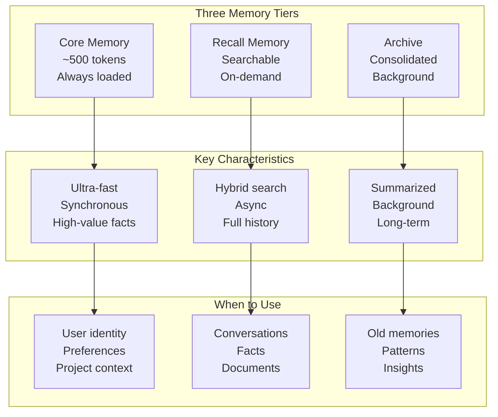

# Memory System Guide

A comprehensive guide to OpenRustClaw's 3-tier memory system, covering Core Memory, Recall Memory, Archive, and best practices.

---

## 🧠 Memory Tiers Overview



---

## 💾 Core Memory

Core memory is a small, high-priority key-value store that is always included in the system prompt.

### Managing Core Memory

#### CLI Commands

```bash
# View core memory
openrustclaw memory core get-all

# Set a core memory entry
openrustclaw memory core set user_name "Alice"
openrustclaw memory core set preferred_language "Rust"
openrustclaw memory core set project_context "Building an AI agent framework"

# Remove an entry
openrustclaw memory core remove temporary_note

# Check token usage
openrustclaw memory core stats
```

#### Programmatic API

```rust
use openrustclaw_core::types::CoreEntry;
use openrustclaw_memory::CoreMemoryManager;

let core = CoreMemoryManager::new(store, 500);  // 500 token budget

// Set entry
core.set(user_id, CoreEntry {
    key: "coding_style".into(),
    value: "Prefer functional programming, immutable data".into(),
    importance: 0.8,
    token_count: 12,
    updated_at: Utc::now(),
}).await?;

// Render for prompt injection
let prompt_section = core.render(user_id).await?;
println!("{}", prompt_section);
// Output:
// ## Core Memory
//
// user_name: Alice
// coding_style: Prefer functional programming, immutable data
// preferred_language: Rust
```

### Core Memory Budget

Core memory is strictly limited (~500 tokens) to prevent prompt bloat:

| Entry Type | Typical Size | Max Entries |
|------------|--------------|-------------|
| User identity | 10-20 tokens | 3-5 entries |
| Preferences | 15-30 tokens | 5-10 entries |
| Project context | 20-50 tokens | 3-5 entries |

When the budget is exceeded, lowest-importance entries are evicted.

### Best Practices for Core Memory

✅ **Do store:**
- User's name and role
- Critical project context
- Strong preferences
- Communication style

❌ **Don't store:**
- Large code snippets
- Full conversations
- Infrequently used facts
- Temporary information

---

## 🔍 Recall Memory

Recall memory is a searchable database of episodic, semantic, and procedural knowledge.

### Memory Types

| Type | Description | Examples |
|------|-------------|----------|
| **Episodic** | Events and experiences | "User mentioned they're going to Japan" |
| **Semantic** | Facts and knowledge | "Tokyo is the capital of Japan" |
| **Procedural** | How-to knowledge | "To deploy: run `cargo build --release`" |

### Searching Memories

#### CLI Commands

```bash
# Basic search
openrustclaw memory search "Japan trip"

# Filter by memory type
openrustclaw memory search "deployment" --type procedural

# Filter by source
openrustclaw memory search "API" --source-type code

# Search with namespace
openrustclaw memory search "database" --namespace workspace/acme

# Limit results
openrustclaw memory search "meeting" --limit 5

# Minimum confidence threshold
openrustclaw memory search "bug" --min-confidence 0.7
```

#### Programmatic API

```rust
use openrustclaw_core::types::{MemoryQuery, MemoryType, SourceType};

let query = MemoryQuery {
    text: "Japan trip planning".into(),
    memory_types: vec![MemoryType::Episodic],
    source_types: vec![],
    namespace: Some("personal".into()),
    limit: 10,
    min_confidence: 0.5,
    recency_weight: 0.3,  // Boost recent memories
};

let results = memory_store.search(&query).await?;

for result in results {
    println!("[{:.2}] {}", result.score, result.entry.content);
}
```

### Hybrid Search Algorithm

Recall memory uses a sophisticated hybrid search:

1. **BM25** — Full-text search for exact matches
2. **Vector similarity** — Semantic search using embeddings
3. **RRF fusion** — Combines both with Reciprocal Rank Fusion
4. **MMR reranking** — Ensures diversity in results
5. **Temporal decay** — Boosts recent memories

```rust
// Configure search parameters
let query = MemoryQuery {
    text: "deployment process".into(),
    
    // Diversity: 0.0 = pure relevance, 1.0 = maximum diversity
    // Default: 0.5
    
    // Recency: 0.0 = ignore recency, 1.0 = heavily prefer recent
    recency_weight: 0.4,
    
    // Memory types to include
    memory_types: vec![MemoryType::Procedural, MemoryType::Semantic],
    
    // Minimum relevance score
    min_confidence: 0.6,
    
    ..Default::default()
};
```

---

## 📝 Storing Memories

### Automatic Storage

The agent automatically stores memories from conversations:

```rust
// This happens automatically in the agent loop
if should_store_memory(&message) {
    let entry = MemoryEntry {
        memory_type: MemoryType::Episodic,
        content: extract_key_information(&message),
        importance: score_importance(&message),
        confidence: score_confidence(&message),
        source: Some("conversation".into()),
        source_type: Some(SourceType::Conversation),
        ..Default::default()
    };
    
    memory_store.store(entry).await?;
}
```

### Manual Storage

#### CLI Commands

```bash
# Store a memory directly
openrustclaw memory store "Remember to review PR #123" \
    --type episodic \
    --importance 0.8 \
    --namespace work

# Store from file
openrustclaw memory store-file ./meeting-notes.txt \
    --type semantic \
    --source "Team Meeting 2024-01-15"
```

#### Programmatic API

```rust
use openrustclaw_core::types::{MemoryEntry, MemoryType, MemorySource};

let entry = MemoryEntry {
    id: Uuid::new_v4(),
    memory_type: MemoryType::Semantic,
    content: "The project uses Axum for the web framework".into(),
    content_hash: sha256("The project uses Axum for the web framework"),
    source: Some("architecture.md".into()),
    source_type: Some(SourceType::Document),
    session_id: None,
    user_id: Some(user_id.into()),
    namespace: "workspace/my-project".into(),
    importance: 0.7,
    confidence: 0.95,
    access_count: 0,
    last_accessed: None,
    created_at: Utc::now(),
    expires_at: None,  // Permanent
    metadata: json!({
        "file_path": "docs/architecture.md",
        "line_number": 42,
    }),
};

memory_store.store(entry).await?;
```

---

## 📦 Archive

Archive contains consolidated summaries of old memories, managed by a background workflow.

### How Archive Works

1. **Identification** — Find stale memories (>30 days, low access)
2. **Clustering** — Group related memories by similarity
3. **Summarization** — Use LLM to create coherent summaries
4. **Storage** — Store summaries, mark originals as archived

### Archive vs Recall

| Aspect | Recall Memory | Archive |
|--------|--------------|---------|
| **Content** | Original memories | Summaries |
| **Search priority** | High | Lower |
| **Size** | Full content | Compressed |
| **Access pattern** | Direct | Via search |

### Accessing Archive

Archive memories are included in searches with lower priority:

```rust
let query = MemoryQuery {
    text: "early project decisions".into(),
    include_archive: true,  // Include archive in search
    ..Default::default()
};

// Results will include both recall memories and archive summaries
// with recall memories ranked higher
```

---

## 🛡️ Memory Policies

### Deduplication

Prevent storing duplicate information:

```rust
// Before storing, check for existing similar content
if let Some(existing) = memory_store.dedupe_check(&content_hash).await? {
    // Update existing entry instead of creating new
    memory_store.update_access_count(&existing).await?;
    return Ok(existing);
}
```

### Importance Scoring

Automatically score memory importance:

| Factor | Impact |
|--------|--------|
| User explicitly asked to remember | +0.5 |
| Contains technical details | +0.3 |
| Personal information | +0.4 |
| Temporary/event-based | -0.2 |
| Vague/uncertain | -0.3 |

### Time-to-Live (TTL)

Set expiration for temporary memories:

```rust
let entry = MemoryEntry {
    expires_at: Some(Utc::now() + Duration::days(7)),
    ..Default::default()
};

// Expired memories are automatically pruned
```

---

## 📤 Import/Export

### Exporting Memories

```bash
# Export all memories to JSON
openrustclaw memory export --format json --output memories.json

# Export specific namespace
openrustclaw memory export --namespace personal --output personal-memories.json

# Export to markdown
openrustclaw memory export --format markdown --output memories.md
```

### Importing Memories

```bash
# Import from JSON
openrustclaw memory import memories.json

# Import with namespace override
openrustclaw memory import memories.json --namespace imported
```

### Programmatic Import/Export

```rust
use openrustclaw_memory::MemoryExporter;

// Export
let exporter = MemoryExporter::new(memory_store);
let export_data = exporter.export_all().await?;
fs::write("backup.json", serde_json::to_string_pretty(&export_data)?).await?;

// Import
let import_data: Vec<MemoryEntry> = serde_json::from_str(&fs::read_to_string("backup.json").await?)?;
for entry in import_data {
    memory_store.store(entry).await?;
}
```

---

## 📊 Memory Statistics

### Viewing Statistics

```bash
# General stats
openrustclaw memory stats

# Output:
# Total memories: 1,234
# Core memory: 450 tokens / 500 max
# Recall memory: 987 entries
#   - Episodic: 456
#   - Semantic: 389
#   - Procedural: 142
# Archive: 23 summaries
# Average search latency: 2.3ms

# Detailed stats
openrustclaw memory stats --detailed

# Stats by namespace
openrustclaw memory stats --namespace workspace/project
```

---

## 🎓 Best Practices

### 1. Use Namespaces

Isolate different contexts:

```rust
// Personal context
entry.namespace = "personal".into();

// Work project
entry.namespace = "workspace/acme-website".into();

// Specific session
entry.namespace = "session/abc123".into();
```

### 2. Set Appropriate TTLs

```rust
// Permanent knowledge
entry.expires_at = None;

// Temporary note
entry.expires_at = Some(Utc::now() + Duration::days(7));

// Event-based memory
entry.expires_at = Some(Utc::now() + Duration::days(30));
```

### 3. Include Metadata

```rust
entry.metadata = json!({
    "source_url": "https://example.com/docs",
    "extracted_by": "document_processor",
    "confidence_source": "user_explicit",
});
```

### 4. Use Source Types

```rust
// Documents
entry.source_type = Some(SourceType::Document);

// Code
entry.source_type = Some(SourceType::Code);

// Configuration
entry.source_type = Some(SourceType::Config);
```

### 5. Let the Agent Search

Don't auto-inject memories. Let the agent decide when to search:

```rust
// Provide the tool
ToolDefinition {
    name: "memory_search".into(),
    description: "Search for relevant information from previous conversations".into(),
    parameters: json!({
        "type": "object",
        "properties": {
            "query": {
                "type": "string",
                "description": "What to search for"
            }
        },
        "required": ["query"]
    }),
}
```

---

## 🔧 Advanced Topics

### Custom Embedding Models

```rust
use openrustclaw_core::traits::EmbeddingProvider;

struct CustomEmbeddingProvider {
    model: String,
}

#[async_trait]
impl EmbeddingProvider for CustomEmbeddingProvider {
    async fn embed(&self, texts: &[&str]) -> Result<Vec<Vec<f32>>> {
        // Your custom embedding logic
    }
    
    fn dimensions(&self) -> usize { 768 }
    fn model_id(&self) -> &str { &self.model }
}
```

### Custom Search Ranking

```rust
impl MemoryStore for CustomStore {
    async fn search(&self, query: &MemoryQuery) -> Result<Vec<ScoredMemory>> {
        // Your custom search logic
        // - Use custom embeddings
        // - Apply domain-specific ranking
        // - Filter by custom metadata
    }
}
```

### Memory Consolidation Trigger

```rust
// Trigger manual consolidation
openrustclaw memory consolidate --user alice

// Or programmatically
let workflow_id = langbridge
    .execute_workflow("memory_maintenance", json!({
        "user_id": "alice",
        "aggressive": false,
    }))
    .await?;
```
