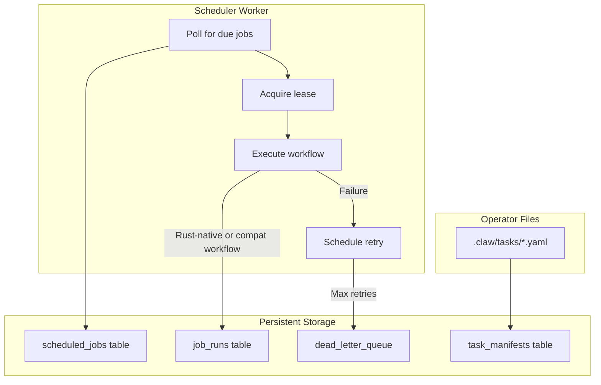

# Durable Scheduling Guide

OpenRustClaw's durable scheduler provides reliable, cron-free task scheduling with automatic retries, idempotency, and crash recovery.

---

## 🎯 Why Durable Scheduling?

Traditional cron-based scheduling has limitations:

| Cron Problem | Durable Scheduler Solution |
|--------------|---------------------------|
| Missed jobs during downtime | Persistent queue with catch-up |
| No retry on failure | Exponential backoff retries |
| Double execution | Idempotency keys |
| No execution history | Full audit trail |
| Single point of failure | Distributed lease/lock |

---

## 🏗️ Architecture



---

## 📋 Creating Jobs

### Task Manifests

OpenRustClaw now supports file-backed task manifests on top of the durable SQLite scheduler.

- Durable truth stays in SQLite.
- Operator-visible manifests live under `.claw/tasks/`.
- You can sync manifests into the scheduler, export jobs back out, and inspect priority/state from CLI or MCP.

### CLI Commands

```bash
# Initialize the standard task folder
openrustclaw schedule init

# Sync manifests from .claw/tasks/ into SQLite
openrustclaw schedule sync

# Preview sync without applying changes
openrustclaw schedule sync --dry-run

# Create a job directly from a manifest
openrustclaw schedule create --file .claw/tasks/daily-report.yaml

# List all jobs
openrustclaw schedule list

# Inspect one task
openrustclaw schedule inspect daily-report

# Pause a job
openrustclaw schedule pause daily-report

# Resume a job
openrustclaw schedule resume daily-report

# Trigger immediately
openrustclaw schedule run-now daily-report

# Reprioritize (lower numbers run first)
openrustclaw schedule reprioritize daily-report 25

# Temporarily disable until a timestamp
openrustclaw schedule disable-until daily-report 2026-03-20T09:00:00Z

# Clear disabled_until
openrustclaw schedule enable daily-report

# Export a job back to YAML
openrustclaw schedule export daily-report

# View job history
openrustclaw schedule runs --job daily-report --limit 50
```

### YAML Task Manifest

```yaml
# .claw/tasks/daily-report.yaml
version: 1
task:
  id: daily-report
  name: Daily Standup Report
  description: Generate and send a daily standup summary
  workflow: reminder
  priority: 50
  enabled: true
  timezone: America/New_York
  owner: ops
  tags:
    - reporting
    - daily
    - team
  max_retries: 3
  trigger:
    type: interval
    every_seconds: 86400
  payload:
    message: Generate and deliver the daily standup summary
  delivery_policy:
    mode: first_success
```

---

## ⏰ Triggers

Current shipped manifest triggers:

```yaml
trigger:
  type: interval
  every_seconds: 3600
```

```yaml
trigger:
  type: absolute
  at: "2026-03-20T09:00:00Z"
```

```yaml
trigger:
  type: event
  event_name: "session.end"
```

```yaml
trigger:
  type: dependency
  depends_on:
    - upstream-task-id
```

---
## 🧭 Operator Notes

- This is not OS cron.
- The scheduler is Rust-owned and durable.
- `.claw/tasks/` is the operator-facing manifest layer.
- Lower `priority` numbers run first.
- If multiple tasks are due together, priority is considered before `next_run_at`.
- Missing manifests discovered during `schedule sync` are paused rather than silently deleted.
    return {"archived_count": count}

workflow.add_node("prune", prune_expired)
workflow.add_node("consolidate", consolidate_old)

workflow.set_entry_point("prune")
workflow.add_edge("prune", "consolidate")
workflow.add_edge("consolidate", END)

maintenance_workflow = workflow.compile()
```

---

## 🛡️ Idempotency

Idempotency prevents duplicate execution when:
- Job is retried after failure
- Multiple workers try to execute same job
- Network issues cause duplicate triggers

### Idempotency Keys

```yaml
# Template-based key
idempotency_key: "daily-report-{{trigger.fire_date}}"

# Result: "daily-report-2024-01-15"
```

Available template variables:

| Variable | Description |
|----------|-------------|
| `{{trigger.fire_date}}` | Date of trigger (YYYY-MM-DD) |
| `{{trigger.fire_time}}` | Time of trigger (ISO 8601) |
| `{{job.id}}` | Job ID |
| `{{job.input.hash}}` | Hash of workflow input |

### Checking Idempotency

```rust
async fn execute_job(&self, job: &ScheduledJob) -> Result<()> {
    // Generate idempotency key
    let key = self.render_idempotency_key(job)?;
    
    // Check if already executed
    if self.idempotency_store.contains(&key).await? {
        tracing::info!("Job {} already executed with key {}", job.id, key);
        return Ok(());
    }
    
    // Execute workflow
    let result = self.execute_workflow(job).await;
    
    // Record execution
    self.idempotency_store.insert(key, job.id.clone()).await?;
    
    result
}
```

---

## 📊 Monitoring Jobs

### Job Status

```bash
# List jobs with status
openrustclaw schedule list --with-status

# Output:
# ID              NAME                    STATUS    LAST RUN    NEXT RUN
# daily-report    Daily Standup Report    active    2 hours ago 22 hours
# weekly-review   Weekly Review           paused    3 days ago  -
# memory-cleanup  Memory Maintenance      active    1 hour ago  23 hours
```

### Job History

```bash
# View recent runs
openrustclaw schedule history daily-report

# Output:
# TIME                    STATUS    DURATION    ERROR
# 2024-01-15 09:00:00     success   2.3s        -
# 2024-01-14 09:00:00     success   1.8s        -
# 2024-01-13 09:00:05     retry     -           Rate limited
# 2024-01-13 09:01:05     success   2.1s        -
```

### Dead Letter Queue

```bash
# View failed jobs
openrustclaw schedule dlq list

# Retry a failed job
openrustclaw schedule dlq retry job-run-abc123

# Delete from DLQ
openrustclaw schedule dlq delete job-run-abc123
```

---

## 🔧 Advanced Topics

### Custom Workflows

Create custom workflows in the Python sidecar:

```python
# sidecar/src/workflows/custom.py
from langgraph.graph import StateGraph

class MyWorkflowState(TypedDict):
    input_data: dict
    processed: bool
    result: Optional[dict]

def process_data(state: MyWorkflowState) -> dict:
    # Your custom logic here
    result = do_something(state["input_data"])
    return {
        "processed": True,
        "result": result,
    }

workflow = StateGraph(MyWorkflowState)
workflow.add_node("process", process_data)
workflow.set_entry_point("process")
workflow.add_edge("process", END)

my_workflow = workflow.compile()
```

Register in `sidecar/src/workflows/__init__.py`:

```python
from .custom import my_workflow

WORKFLOWS = {
    "generate_report": reminder_workflow,
    "memory_maintenance": maintenance_workflow,
    "my_custom_workflow": my_workflow,  # Add here
}
```

### Lease Management

The scheduler uses leases to prevent concurrent execution:

```rust
pub struct LeaseManager {
    db: SqlitePool,
    lease_duration: Duration,
}

impl LeaseManager {
    /// Try to acquire lease for job execution
    pub async fn acquire(&self, job_id: &str) -> Result<Lease> {
        let lease_id = Uuid::new_v4();
        let expires_at = Utc::now() + self.lease_duration;
        
        // Atomic lease acquisition via UPDATE
        let result = sqlx::query(
            r#"
            UPDATE scheduled_jobs
            SET lease_id = ?, lease_expires_at = ?
            WHERE id = ?
              AND (lease_id IS NULL OR lease_expires_at < ?)
            "#
        )
        .bind(&lease_id)
        .bind(&expires_at)
        .bind(job_id)
        .bind(Utc::now())
        .execute(&self.db)
        .await?;
        
        if result.rows_affected() == 0 {
            return Err(Error::Scheduler(SchedulerError::LeaseAcquisitionFailed {
                job_id: job_id.into(),
            }));
        }
        
        Ok(Lease {
            id: lease_id,
            job_id: job_id.into(),
            expires_at,
        })
    }
    
    /// Renew lease during long-running jobs
    pub async fn renew(&self, lease: &Lease) -> Result<Lease> {
        let new_expires = Utc::now() + self.lease_duration;
        
        sqlx::query(
            "UPDATE scheduled_jobs SET lease_expires_at = ? WHERE lease_id = ?"
        )
        .bind(&new_expires)
        .bind(&lease.id)
        .execute(&self.db)
        .await?;
        
        Ok(Lease {
            expires_at: new_expires,
            ..lease.clone()
        })
    }
    
    /// Release lease after completion
    pub async fn release(&self, lease: &Lease) -> Result<()> {
        sqlx::query(
            "UPDATE scheduled_jobs SET lease_id = NULL, lease_expires_at = NULL WHERE lease_id = ?"
        )
        .bind(&lease.id)
        .execute(&self.db)
        .await?;
        
        Ok(())
    }
}
```

---

## 🎓 Best Practices

### 1. Always Set Idempotency Keys

```yaml
# Good
idempotency_key: "daily-report-{{trigger.fire_date}}"

# Bad - may execute multiple times
# (no idempotency_key)
```

### 2. Handle Timezones Correctly

```yaml
# Good - explicit timezone
timezone: "America/New_York"

# Bad - relies on server timezone
timezone: "UTC"  # User expects local time
```

### 3. Set Appropriate Retries

```yaml
# API calls may need more retries
retry:
  max_attempts: 5
  backoff: exponential
  initial_delay_secs: 60

# Local operations need fewer
retry:
  max_attempts: 2
  backoff: fixed
  initial_delay_secs: 10
```

### 4. Monitor the Dead Letter Queue

```bash
# Add to your monitoring
openrustclaw schedule dlq list | wc -l
# Alert if > 0
```

### 5. Test Jobs Before Enabling

```bash
# Dry run
openrustclaw schedule run my-job --now --dry-run

# Test with real execution
openrustclaw schedule run my-job --now

# Then enable scheduled execution
openrustclaw schedule resume my-job
```
