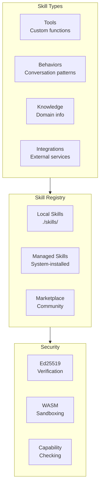

# Creating Skills Guide

Skills extend OpenRustClaw's capabilities with custom tools, behaviors, and integrations. This guide covers creating, registering, and using skills.

---

## 🎯 What Are Skills?

Skills are reusable, shareable packages that add capabilities to OpenRustClaw:

- **Tools** — Custom functions the agent can call
- **Behaviors** — Conversation patterns and responses
- **Knowledge** — Domain-specific information
- **Integrations** — Connections to external services



---

## 📄 SKILL.md Format

Skills are defined in `SKILL.md` files with TOML frontmatter:

```markdown
---
name = "git-helper"
version = "1.0.0"
description = "Git repository management tools"
author = "Your Name <you@example.com>"
license = "MIT"

[capabilities]
file_read = true
file_write = true
network_access = false
shell_exec = true

[signing]
public_key = "ed25519:abc123..."
signature = "def456..."
---

# Git Helper Skill

This skill provides tools for managing Git repositories.

## Tools

### git_status

Show the current git repository status.

```json
{
  "name": "git_status",
  "description": "Get git repository status",
  "parameters": {
    "type": "object",
    "properties": {
      "repo_path": {
        "type": "string",
        "description": "Path to git repository"
      }
    },
    "required": ["repo_path"]
  }
}
```

### git_commit

Commit changes with a message.

```json
{
  "name": "git_commit",
  "description": "Commit changes to git",
  "parameters": {
    "type": "object",
    "properties": {
      "repo_path": {"type": "string"},
      "message": {"type": "string"},
      "files": {
        "type": "array",
        "items": {"type": "string"}
      }
    },
    "required": ["repo_path", "message"]
  }
}
```

## Usage Examples

```
User: Check the status of my repo
Agent: [git_status] {"repo_path": "."}
```
```

---

## 🛠️ Creating a Skill

### Step 1: Create Directory Structure

```bash
mkdir -p skills/my-skill/src
```

### Step 2: Write SKILL.md

```bash
cat > skills/my-skill/SKILL.md << 'EOF'
---
name = "my-skill"
version = "1.0.0"
description = "My custom skill"

[capabilities]
file_read = true
---

# My Skill

Description of what this skill does.

## Tools

### my_tool

Description of my_tool.

\`\`\`json
{
  "name": "my_tool",
  "description": "What it does",
  "parameters": {
    "type": "object",
    "properties": {
      "param1": {"type": "string"}
    },
    "required": ["param1"]
  }
}
\`\`\`
EOF
```

### Step 3: Implement the Tool

For native Rust tools, create a Rust file:

```rust
// skills/my-skill/src/lib.rs
use async_trait::async_trait;
use openrustclaw_core::traits::{Tool, ToolContext};
use openrustclaw_core::types::{SkillCapability, ToolOutput};
use serde_json::Value;

pub struct MyTool;

#[async_trait]
impl Tool for MyTool {
    fn name(&self) -> &str {
        "my_tool"
    }
    
    fn description(&self) -> &str {
        "What my_tool does"
    }
    
    fn schema(&self) -> Value {
        serde_json::json!({
            "type": "object",
            "properties": {
                "param1": {
                    "type": "string",
                    "description": "Parameter description"
                }
            },
            "required": ["param1"]
        })
    }
    
    fn capabilities_required(&self) -> Vec<SkillCapability> {
        vec![SkillCapability::FileRead]
    }
    
    async fn execute(&self, input: Value, ctx: &ToolContext) -> Result<ToolOutput> {
        let param1 = input["param1"].as_str()
            .ok_or_else(|| Error::invalid_input("param1 required"))?;
        
        // Your implementation here
        let result = do_something(param1).await?;
        
        Ok(ToolOutput {
            tool_call_id: ctx.tool_call_id.clone(),
            content: serde_json::to_string(&result)?,
            is_error: false,
        })
    }
}
```

### Step 4: Register the Skill

```rust
// In your agent configuration
use openrustclaw_skills::SkillRegistry;

let registry = SkillRegistry::new();

// Load from directory
registry.load_from_dir("./skills/my-skill").await?;

// Or load built-in skills
registry.load_builtin::<MyTool>().await?;
```

---

## 🦀 Native Rust Skills

### Tool Trait Implementation

```rust
use async_trait::async_trait;
use openrustclaw_core::{
    traits::{Tool, ToolContext},
    types::{SkillCapability, ToolOutput},
    error::{Error, Result},
};
use serde_json::Value;

pub struct FileSearchTool {
    max_depth: usize,
}

#[async_trait]
impl Tool for FileSearchTool {
    fn name(&self) -> &str {
        "file_search"
    }
    
    fn description(&self) -> &str {
        "Search for files matching a pattern in the workspace"
    }
    
    fn schema(&self) -> Value {
        serde_json::json!({
            "type": "object",
            "properties": {
                "pattern": {
                    "type": "string",
                    "description": "Glob pattern to search for"
                },
                "path": {
                    "type": "string",
                    "description": "Directory to search in (default: workspace root)"
                }
            },
            "required": ["pattern"]
        })
    }
    
    fn capabilities_required(&self) -> Vec<SkillCapability> {
        vec![SkillCapability::FileRead]
    }
    
    async fn execute(&self, input: Value, ctx: &ToolContext) -> Result<ToolOutput> {
        let pattern = input["pattern"].as_str()
            .ok_or_else(|| Error::invalid_input("pattern required"))?;
        
        let path = input["path"].as_str()
            .or(ctx.workspace_path.as_deref())
            .ok_or_else(|| Error::invalid_input("path required"))?;
        
        // Execute search
        let files = glob::glob(&format!("{}/{}", path, pattern))
            .map_err(|e| Error::execution_failed(format!("Invalid pattern: {}", e)))?
            .filter_map(Result::ok)
            .take(self.max_depth)
            .collect::<Vec<_>>();
        
        Ok(ToolOutput {
            tool_call_id: ctx.tool_call_id.clone(),
            content: serde_json::to_string(&files)?,
            is_error: false,
        })
    }
}
```

---

## 🔒 WASM Sandbox Status

WASM skill execution is planned, but the current sandbox module is still scaffolding.
Today, use this section as design guidance rather than an available execution path.

### WASM Skill Example (Rust)

```rust
// skills/wasm-example/src/lib.rs
use serde::{Deserialize, Serialize};

#[derive(Deserialize)]
struct Input {
    text: String,
}

#[derive(Serialize)]
struct Output {
    word_count: usize,
    char_count: usize,
}

#[no_mangle]
pub extern "C" fn process_data(input_ptr: i32, input_len: i32) -> i64 {
    // Read input from memory
    let input_bytes = unsafe {
        std::slice::from_raw_parts(input_ptr as *const u8, input_len as usize)
    };
    
    let input: Input = serde_json::from_slice(input_bytes).unwrap();
    
    // Process
    let output = Output {
        word_count: input.text.split_whitespace().count(),
        char_count: input.text.chars().count(),
    };
    
    // Return pointer to output (simplified)
    let output_bytes = serde_json::to_vec(&output).unwrap();
    // ... allocate and return
    0
}
```

---

## ✍️ Skill Signing

Cryptographic signatures ensure skill integrity:

### Generating Keys

```bash
# Generate Ed25519 keypair
openrustclaw security generate-keys --output ./keys

# Output:
# Public key: ed25519:abc123...
# Private key saved to: ./keys/private.key
```

### Signing a Skill

```bash
# Sign the SKILL.md file
openrustclaw security sign-skill \
    --skill ./skills/my-skill/SKILL.md \
    --key ./keys/private.key

# Signature is added to SKILL.md frontmatter
```

### Verification

```rust
use openrustclaw_security::SkillVerifier;

let verifier = SkillVerifier::new()
    .add_trusted_key("ed25519:abc123...")?;

let skill = Skill::from_file("./skills/my-skill/SKILL.md").await?;

match verifier.verify(&skill) {
    Ok(()) => println!("✓ Skill verified"),
    Err(e) => println!("✗ Verification failed: {}", e),
}
```

---

## 🏪 Skill Registry

### Local Registry

```bash
# List installed skills
openrustclaw skills list

# Install from directory
openrustclaw skills install ./skills/my-skill

# Install from git
openrustclaw skills install https://github.com/user/my-skill

# Remove a skill
openrustclaw skills remove my-skill

# Update a skill
openrustclaw skills update my-skill
```

### Marketplace (Future)

```bash
# Search marketplace
openrustclaw skills search "git"

# Install from marketplace
openrustclaw skills install marketplace:git-helper

# Verify before install
openrustclaw skills verify marketplace:git-helper
```

---

## 🔧 Skill Capabilities

Skills declare required capabilities:

```toml
[capabilities]
file_read = true       # Read files
file_write = true      # Write files
network_access = false # No network (default)
shell_exec = true      # Execute shell commands
database_access = false # Database access
memory_write = true    # Write to memory
```

### Capability Checking

```rust
impl Tool for MyTool {
    fn capabilities_required(&self) -> Vec<SkillCapability> {
        vec![
            SkillCapability::FileRead,
            SkillCapability::NetworkAccess,
        ]
    }
    
    async fn execute(&self, input: Value, ctx: &ToolContext) -> Result<ToolOutput> {
        // Verify capabilities at runtime
        ctx.verify_capability(SkillCapability::FileRead)?;
        ctx.verify_capability(SkillCapability::NetworkAccess)?;
        
        // Execute with capability restrictions
        // ...
    }
}
```

---

## 📚 Example Skills

### Git Helper

```markdown
---
name = "git-helper"
version = "1.2.0"
description = "Git repository management"

[capabilities]
shell_exec = true
file_read = true
---

Tools: git_status, git_commit, git_branch, git_log
```

### Database Query

```markdown
---
name = "db-query"
version = "1.0.0"
description = "Database query tools"

[capabilities]
database_access = true
---

Tools: sql_query, describe_table, list_tables
```

### Web Search

```markdown
---
name = "web-search"
version = "2.0.0"
description = "Web search via Brave API"

[capabilities]
network_access = true
---

Tools: search_web, get_page_content
```

---

## 🎓 Best Practices

### 1. Declare Minimal Capabilities

```toml
# Good - only what's needed
[capabilities]
file_read = true

# Bad - unnecessary capabilities
[capabilities]
file_read = true
file_write = true
shell_exec = true
network_access = true
```

### 2. Sign Your Skills

Always sign skills before distribution:

```bash
openrustclaw security sign-skill --skill SKILL.md --key private.key
```

### 3. Handle Errors Gracefully

```rust
async fn execute(&self, input: Value, ctx: &ToolContext) -> Result<ToolOutput> {
    match self.do_work().await {
        Ok(result) => Ok(ToolOutput {
            content: serde_json::to_string(&result)?,
            is_error: false,
            ..Default::default()
        }),
        Err(e) => Ok(ToolOutput {
            content: format!("Error: {}", e),
            is_error: true,
            ..Default::default()
        }),
    }
}
```

### 4. Validate Input Thoroughly

```rust
async fn execute(&self, input: Value, ctx: &ToolContext) -> Result<ToolOutput> {
    let path = input["path"].as_str()
        .ok_or_else(|| Error::invalid_input("path required"))?;
    
    // Validate path is within workspace
    let canonical = std::fs::canonicalize(path)?;
    let workspace = std::fs::canonicalize(&ctx.workspace_path)?;
    
    if !canonical.starts_with(&workspace) {
        return Err(Error::Security(SecurityError::PermissionDenied(
            "Path outside workspace".into()
        )));
    }
    
    // ... proceed
}
```

### 5. Document Your Skills

Include in SKILL.md:
- Clear description
- Usage examples
- Required capabilities
- Expected input/output
- Error conditions
